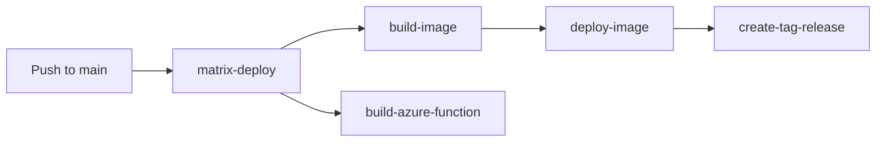

# GitHub Workflows

All CI/CD automation for the service lives in `.github/workflows/`. Reusable actions are in `.github/actions/`.

## PR checks

These workflows run automatically on pull requests:

| Workflow | Trigger | What it does |
|---|---|---|
| `code-pr-check.yml` | PR | Builds solution, runs unit tests, pushes results to SonarCloud |
| `terraform-pr-check.yml` | PR / push | Init, plan, format check, lint, security scan, posts plan to PR |
| `build-web-assets.yml` | PR | Builds JS + CSS assets and commits any changes back to the branch |
| `e2e-tests.yml` | PR / manual | Runs Cypress E2E tests |
| `qa-viz-tests.yml` | PR / manual | Runs qa-visualiser lint and unit tests |
| `validate-scripts.yml` | PR / push / manual | Validates SQL migration scripts |
| `verify-checks-running.yml` | PR | Confirms that required status checks are executing |

## Deployment pipeline



| Workflow | Trigger | What it does |
|---|---|---|
| `matrix-deploy.yml` | Push to main / manual | Orchestrates the full build-and-deploy sequence for each environment |
| `build-image.yml` | Called by matrix-deploy | Builds the Docker image and pushes it to the container registry |
| `build-azure-function.yml` | Called by matrix-deploy | Builds the .NET Azure Function app |
| `deploy-image.yml` | Called by matrix-deploy | Deploys the built image to a target Azure Container App environment |
| `infrastructure-deploy.yml` | Manual | Deploys Terraform infrastructure changes to a named environment |
| `terraform-dns.yml` | Manual / called | Plans and applies DNS zone Terraform changes |
| `create-tag-release.yml` | Called by matrix-deploy | Creates a GitHub release and semver tag using Semantic Release |

Environments: **Dev**, **Test**, **Staging**, **Production**. Dev and Test deploy automatically on merge to `main`; Staging and Production require manual trigger.

## E2E tests

| Workflow | Trigger | What it does |
|---|---|---|
| `e2e-tests.yml` | PR / manual | Cypress E2E tests (original suite) |
| `e2e-test-playwright.yml` | Manual | Playwright E2E regression tests against a local instance |
| `e2e-test-playwright-environment.yml` | Manual / called | Playwright E2E regression tests against a named environment |
| `e2e-test-smoke-local.yml` | Manual | Playwright smoke tests against a local instance |
| `e2e-test-smoke-environment.yml` | Manual / called | Playwright smoke tests against a named environment |

## Scheduled / maintenance workflows

| Workflow | Schedule | What it does |
|---|---|---|
| `contentful-backup.yml` | Weekly (Tue 00:00) | Backs up the Contentful space |
| `broken-link-checker.yml` | Manual | Validates all hyperlinks in Contentful content |
| `mutations-testing.yml` | Nightly (23:00) | Runs mutation tests against the unit test suite |
| `check-secret-expiry-all-environments.yml` | Scheduled | Checks Azure Key Vault secrets are not near expiry across all environments |
| `check-environment-availability-all-environments.yml` | Scheduled | Checks that all environments are responding |
| `update-gias-data-scheduled.yml` | Scheduled | Refreshes GIAS (school register) data automatically |
| `qa-viz.yml` | Manual / called | Runs the `qa-visualiser` to generate question flowcharts |

## Operational / manual workflows

| Workflow | What it does |
|---|---|
| `flush-redis-cache.yml` | Flushes the Redis cache for a named environment |
| `clear-submission-data-from-db.yml` | Clears all submission data for a test establishment (for E2E test resets and demos) |
| `update-gias-data-manual.yml` | Manually triggers a GIAS data refresh for a named environment |

## Reusable workflows (called by others)

| Workflow | Purpose |
|---|---|
| `build-image.yml` | Build Docker image |
| `build-azure-function.yml` | Build Azure Function |
| `deploy-image.yml` | Deploy to a Container App environment |
| `check-environment-availability.yml` | Single-environment availability check |
| `check-secret-expiry.yml` | Single-environment secret expiry check |
| `create-tag-release.yml` | Semantic versioning and GitHub release |
| `update-gias-data-common.yml` | GIAS data refresh logic shared by manual and scheduled variants |
| `terraform-dns.yml` | DNS Terraform plan/apply |
| `e2e-test-playwright-environment.yml` | Playwright regression tests |
| `e2e-test-smoke-environment.yml` | Playwright smoke tests |
| `qa-viz.yml` | QA visualiser run |

## Versioning and conventional commits

The `create-tag-release` workflow uses [Semantic Release](https://github.com/semantic-release/semantic-release) with [Conventional Commits](https://www.conventionalcommits.org/). Commit messages determine the semver bump:

- `feat:` → minor
- `fix:` → patch
- `BREAKING CHANGE:` → major
- Other prefixes (`chore:`, `docs:`, `test:`, etc.) → no release

## Testing workflows with GitHub CLI

Push the workflow file to the feature branch first (with `push:` added as a trigger temporarily so GitHub discovers it), then run:

```bash
gh workflow run '<workflow name>' --ref <branch>
```

For workflows with inputs:

```bash
gh workflow run clear-submission-data-from-db.yml --ref development \
  -f environment="Dev" \
  -f establishment="DSI TEST Establishment (001) Community School"
```
