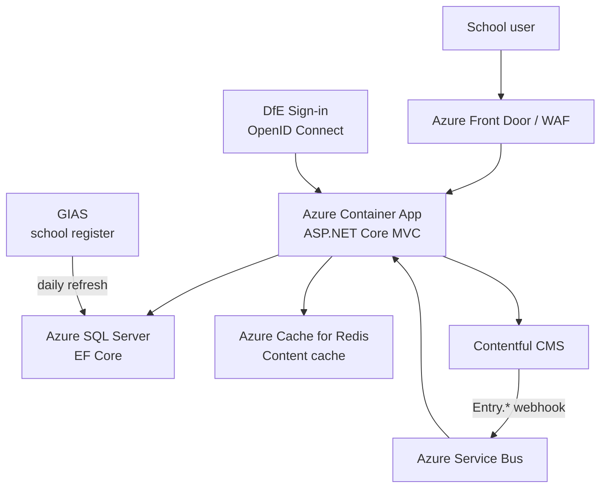

# Plan Technology for Your School

A GOV.UK service that helps school leaders and technology leads plan a technology roadmap for their school. Users complete a self-assessment across a set of technology topics; the service produces maturity-rated recommendations for each area.

## Quick start

1. **Prerequisites**: .NET 9.0 SDK, Node.js, SQL Server (or Docker), Redis (or Docker)
2. **Start here**: [`src/Dfe.PlanTech.Web/README.md`](src/Dfe.PlanTech.Web/README.md) — full local setup instructions
3. **Database setup**: [`tests/Dfe.PlanTech.Web.SeedTestData/README.md`](tests/Dfe.PlanTech.Web.SeedTestData/README.md) — create a local database with test data

## Architecture

The application is an **ASP.NET Core MVC** web app hosted on **Azure Container Apps**. Content (questions, answers, recommendations, static pages) is stored in **Contentful CMS** and cached in **Redis**. When CMS content changes, Contentful fires a webhook to **Azure Service Bus**, which the app processes to invalidate the relevant cache entries. School and establishment data is sourced from **GIAS** and refreshed daily. Authentication is via **DfE Sign-in** (OpenID Connect).

## Repository structure

| Directory | What it contains |
|---|---|
| [`src/`](src/README.md) | All .NET source projects — web app, infrastructure, data access, build |
| [`tests/`](tests/README.md) | All test projects — unit, integration, E2E (Cypress + Playwright) |
| [`contentful/`](contentful/README.md) | Node.js / Python tooling for CMS management, QA, and data export |
| [`terraform/`](terraform/README.md) | Infrastructure as Code — Azure Container Apps, SQL, Redis, Key Vault, Service Bus |
| [`docs/`](docs/README.md) | Architecture Decision Records, CMS documentation, conventions |
| [`utils/`](utils/README.md) | Operational utilities — DSI user lookup, GIAS data refresh |
| [`coding-style/`](coding-style/README.md) | Formatting tools, pre-commit hooks, linting configuration |
| [`bruno/`](bruno/README.md) | Bruno API request collection — app webhook, Contentful |
| [`.github/`](.github/README.md) | GitHub Actions workflows — CI, deployment, scheduled maintenance |
| [`tests-old/`](tests-old/README.md) | Legacy test projects (superseded, not run in CI) |

## Technology stack

| Layer | Technology |
|---|---|
| Web framework | ASP.NET Core 9.0 MVC |
| ORM | Entity Framework Core 9 / SQL Server |
| CMS | Contentful (headless) |
| Cache | Redis (StackExchange.Redis + GZip compression) |
| Auth | DfE Sign-in (OpenID Connect) |
| Messaging | Azure Service Bus |
| Frontend | GOV.UK Frontend + DfE Frontend, esbuild + Sass |
| Infrastructure | Azure Container Apps, Terraform |
| CI/CD | GitHub Actions |
| Tests | xUnit, NSubstitute, Cypress, Playwright/Cucumber |

## Key documentation

- [Running locally](src/Dfe.PlanTech.Web/README.md)
- [Source projects overview](src/README.md)
- [Authentication (DfE Sign-in)](docs/Authentication.md)
- [CMS content and caching](docs/cms/README.md)
- [Database migrations](src/Dfe.PlanTech.DatabaseUpgrader/README.md)
- [Coding style and formatting](coding-style/README.md)
- [GitHub workflows](`.github/README.md`)
- [Architecture Decision Records](docs/architecture-decision-record/README.md)
- [Terraform infrastructure](terraform/README.md)
- [oh-no-thoughts.md](oh-no-thoughts.md) — running log of code quality concerns
