# Plan Technology for Your School

A GOV.UK service that helps school leaders and technology leads plan a technology roadmap for their school. Users complete a self-assessment across a set of technology topics; the service produces maturity-rated recommendations for each area.

## Quick start

1. **Prerequisites**: .NET 9.0 SDK, Node.js, SQL Server (or Docker), Redis (or Docker)
2. **Start here**: [`src/Dfe.PlanTech.Web/README.md`](src/Dfe.PlanTech.Web/README.md) — full local setup instructions
3. **Database setup**: [`tests/Dfe.PlanTech.Web.SeedTestData/README.md`](tests/Dfe.PlanTech.Web.SeedTestData/README.md) — create a local database with test data

## Architecture

```mermaid
flowchart TD
    User[School user] --> WAF[Azure Front Door / WAF]
    WAF --> App[Azure Container App\nASP.NET Core MVC]
    App --> SQL[Azure SQL Server\nEF Core]
    App --> Redis[Azure Cache for Redis\nContent cache]
    App --> CF[Contentful CMS]
    CF -- "Entry.* webhook" --> SB[Azure Service Bus]
    SB --> App
    DSI[DfE Sign-in\nOpenID Connect] --> App
    GIAS[GIAS\nschool register] -- "daily refresh" --> SQL
```

The application is an **ASP.NET Core MVC** web app hosted on **Azure Container Apps**. Content (questions, answers, recommendations, static pages) is stored in **Contentful CMS** and cached in **Redis**. When CMS content changes, Contentful fires a webhook to **Azure Service Bus**, which the app processes to invalidate the relevant cache entries. School and establishment data is sourced from **GIAS** and refreshed daily. Authentication is via **DfE Sign-in** (OpenID Connect).

## Repository structure

| Directory | What it contains |
|---|---|
| [`src/`](src/README.md) | All .NET source projects — web app, infrastructure, data access, build |
| [`tests/`](tests/README.md) | All test projects — unit, integration, E2E (Cypress + Playwright) |
| [`contentful/`](contentful/README.md) | Node.js / Python tooling for CMS management, QA, and data export |
| [`terraform/`](terraform/README.md) | Infrastructure as Code — Azure Container Apps, SQL, Redis, Key Vault, Service Bus |
| [`docs/`](docs/README.md) | Architecture Decision Records, CMS documentation, conventions |
| [`utils/`](utils/README.md) | Operational utilities — DSI user lookup, GIAS data refresh |
| [`coding-style/`](coding-style/README.md) | Formatting tools, pre-commit hooks, linting configuration |
| [`bruno/`](bruno/README.md) | Bruno API request collection — app webhook, Contentful |
| [`.github/`](.github/README.md) | GitHub Actions workflows — CI, deployment, scheduled maintenance |
| [`tests-old/`](tests-old/README.md) | Legacy test projects (superseded, not run in CI) |

## Technology stack

| Layer | Technology |
|---|---|
| Web framework | ASP.NET Core 9.0 MVC |
| ORM | Entity Framework Core 9 / SQL Server |
| CMS | Contentful (headless) |
| Cache | Redis (StackExchange.Redis + GZip compression) |
| Auth | DfE Sign-in (OpenID Connect) |
| Messaging | Azure Service Bus |
| Frontend | GOV.UK Frontend + DfE Frontend, esbuild + Sass |
| Infrastructure | Azure Container Apps, Terraform |
| CI/CD | GitHub Actions |
| Tests | xUnit, NSubstitute, Cypress, Playwright/Cucumber |

## Key documentation

- [Running locally](src/Dfe.PlanTech.Web/README.md)
- [Source projects overview](src/README.md)
- [Authentication (DfE Sign-in)](docs/Authentication.md)
- [CMS content and caching](docs/cms/README.md)
- [Database migrations](src/Dfe.PlanTech.DatabaseUpgrader/README.md)
- [Coding style and formatting](coding-style/README.md)
- [GitHub workflows](`.github/README.md`)
- [Architecture Decision Records](docs/architecture-decision-record/README.md)
- [Terraform infrastructure](terraform/README.md)

## Full documentation index

Every piece of documentation in the repository is listed below, grouped by topic.

Beneath that is a map showing exactly where each is located.

### Getting started

- [Running the web app locally](src/Dfe.PlanTech.Web/README.md)
- [Local database setup](tests/Dfe.PlanTech.Web.SeedTestData/README.md)
- [Coding conventions](docs/Conventions.md)
- [Coding style and formatting](coding-style/README.md) · [Formatting reference](coding-style/FORMATTING.md) · [Tooling](coding-style/TOOLING.md)

### Application source

- [Source projects overview](src/README.md)
- [Core shared library](src/Dfe.PlanTech.Core/README.md)
- [Application layer](src/Dfe.PlanTech.Application/README.md)
- [SQL data layer](src/Dfe.PlanTech.Data.Sql/README.md)
- [Contentful data layer](src/Dfe.PlanTech.Data.Contentful/README.md)
- [Database schema migrations](src/Dfe.PlanTech.DatabaseUpgrader/README.md)
- [Redis cache infrastructure](src/Dfe.PlanTech.Infrastructure.Redis/README.md)
- [Service Bus infrastructure](src/Dfe.PlanTech.Infrastructure.ServiceBus/README.md)
- [DfE Sign-in infrastructure](src/Dfe.PlanTech.Infrastructure.SignIn/README.md)
- [Node.js frontend build](src/Dfe.PlanTech.Web.Node/README.md)
- [Web application](src/Dfe.PlanTech.Web/README.md)

### Authentication

- [Authentication overview](docs/Authentication.md)
- [DfE Sign-in infrastructure](src/Dfe.PlanTech.Infrastructure.SignIn/README.md)
- [Page routing and authorisation](docs/Routers.md)

### CMS (Contentful)

- [CMS overview](docs/cms/README.md)
- [Content types and data usage](docs/cms/contentful-content-usage.md)
- [Redis caching strategy](docs/cms/contentful-redis-caching.md)
- [Contentful tooling overview](contentful/README.md)
- [Broken link checker](contentful/broken-link-checker/README.md)
- [Content management scripts](contentful/content-management/README.md)
- [Content migrations](contentful/content-migrations/README.md)
- [Export processor](contentful/export-processor/README.md)
- [QA visualiser](contentful/qa-visualiser/README.md)
- [Webhook creator](contentful/webhook-creator/README.md)
- [Contentful tool tests](contentful/tests/README.md)

### Testing

- [Tests overview](tests/README.md)
- [Cypress E2E tests](tests/Dfe.PlanTech.Web.E2ETests/README.md)
- [Dynamic page validator](tests/Dfe.PlanTech.Web.E2ETests/cypress/e2e/dynamic-page-validator/dynamic-page-validator-readme.md)
- [Playwright E2E tests (Beta)](tests/Dfe.PlanTech.Web.E2ETests.Beta/README.md)
- [Seed test data](tests/Dfe.PlanTech.Web.SeedTestData/README.md)
- [Data.Contentful unit tests](tests/Dfe.PlanTech.Data.Contentful.UnitTests/README.md)

### Infrastructure

- [Terraform overview](terraform/README.md)
- [Container App infrastructure](terraform/container-app/README.md)
- [Terraform configuration reference](terraform/container-app/terraform-configuration.md)
- [DNS zones](terraform/dns-zone/README.md)
- [GitHub Actions workflows](.github/README.md)

### Operational utilities

- [Utils overview](utils/README.md)
- [Retrieve user data (DSI)](utils/retrieve-user-data/README.md)
- [Update GIAS data](utils/update-gias-data/README.md)
- [Bruno API collection](bruno/README.md)

### Architecture decisions

- [Architecture Decision Records index](docs/architecture-decision-record/README.md)

### Code quality

- [oh-no-thoughts.md](oh-no-thoughts.md) — running log of code quality concerns spotted during the documentation update

## README map

Every `README.md` in the repository, showing where to find them:

.
├── [README.md](README.md)
├── .github/
│   └── [README.md](.github/README.md)
├── bruno/
│   └── [README.md](bruno/README.md)
├── coding-style/
│   └── [README.md](coding-style/README.md)
├── contentful/
│   ├── [README.md](contentful/README.md)
│   ├── broken-link-checker/
│   │   └── [README.md](contentful/broken-link-checker/README.md)
│   ├── content-management/
│   │   └── [README.md](contentful/content-management/README.md)
│   ├── content-migrations/
│   │   └── [README.md](contentful/content-migrations/README.md)
│   ├── export-processor/
│   │   └── [README.md](contentful/export-processor/README.md)
│   ├── qa-visualiser/
│   │   └── [README.md](contentful/qa-visualiser/README.md)
│   ├── tests/
│   │   └── [README.md](contentful/tests/README.md)
│   └── webhook-creator/
│       └── [README.md](contentful/webhook-creator/README.md)
├── docs/
│   ├── [README.md](docs/README.md)
│   ├── architecture-decision-record/
│   │   └── [README.md](docs/architecture-decision-record/README.md)
│   └── cms/
│       └── [README.md](docs/cms/README.md)
├── src/
│   ├── [README.md](src/README.md)
│   ├── Dfe.PlanTech.Application/
│   │   └── [README.md](src/Dfe.PlanTech.Application/README.md)
│   ├── Dfe.PlanTech.Core/
│   │   └── [README.md](src/Dfe.PlanTech.Core/README.md)
│   ├── Dfe.PlanTech.Data.Contentful/
│   │   └── [README.md](src/Dfe.PlanTech.Data.Contentful/README.md)
│   ├── Dfe.PlanTech.Data.Sql/
│   │   └── [README.md](src/Dfe.PlanTech.Data.Sql/README.md)
│   ├── Dfe.PlanTech.DatabaseUpgrader/
│   │   └── [README.md](src/Dfe.PlanTech.DatabaseUpgrader/README.md)
│   ├── Dfe.PlanTech.Infrastructure.Redis/
│   │   └── [README.md](src/Dfe.PlanTech.Infrastructure.Redis/README.md)
│   ├── Dfe.PlanTech.Infrastructure.ServiceBus/
│   │   └── [README.md](src/Dfe.PlanTech.Infrastructure.ServiceBus/README.md)
│   ├── Dfe.PlanTech.Infrastructure.SignIn/
│   │   └── [README.md](src/Dfe.PlanTech.Infrastructure.SignIn/README.md)
│   ├── Dfe.PlanTech.Web/
│   │   └── [README.md](src/Dfe.PlanTech.Web/README.md)
│   └── Dfe.PlanTech.Web.Node/
│       └── [README.md](src/Dfe.PlanTech.Web.Node/README.md)
├── terraform/
│   ├── [README.md](terraform/README.md)
│   ├── container-app/
│   │   ├── [README.md](terraform/container-app/README.md)
│   │   └── upgrade-scripts/
│   │       ├── [README.md](terraform/container-app/upgrade-scripts/README.md)
│   │       └── sprint_33/
│   │           └── [README.md](terraform/container-app/upgrade-scripts/sprint_33/README.md)
│   └── dns-zone/
│       └── [README.md](terraform/dns-zone/README.md)
├── tests/
│   ├── [README.md](tests/README.md)
│   ├── Dfe.PlanTech.Data.Contentful.UnitTests/
│   │   └── [README.md](tests/Dfe.PlanTech.Data.Contentful.UnitTests/README.md)
│   ├── Dfe.PlanTech.Web.E2ETests/
│   │   └── [README.md](tests/Dfe.PlanTech.Web.E2ETests/README.md)
│   ├── Dfe.PlanTech.Web.E2ETests.Beta/
│   │   └── [README.md](tests/Dfe.PlanTech.Web.E2ETests.Beta/README.md)
│   └── Dfe.PlanTech.Web.SeedTestData/
│       └── [README.md](tests/Dfe.PlanTech.Web.SeedTestData/README.md)
├── tests-old/
│   └── [README.md](tests-old/README.md)
└── utils/
    ├── [README.md](utils/README.md)
    ├── retrieve-user-data/
    │   └── [README.md](utils/retrieve-user-data/README.md)
    └── update-gias-data/
        └── [README.md](utils/update-gias-data/README.md)
