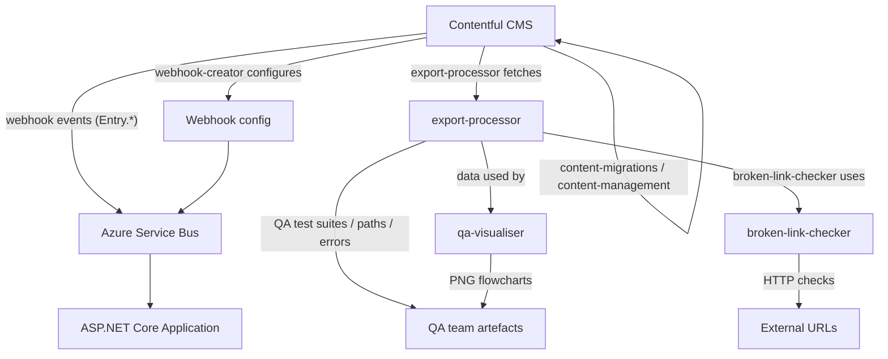

# Contentful Tooling

A collection of Node.js, TypeScript, and Python tools for managing the Contentful CMS content that powers the Plan Technology for Your School service. These tools are used by the development team to configure webhooks, migrate content schemas, inspect user journey logic, validate content quality, and generate QA test artefacts.

## Tools

| Directory | Language | Purpose |
|---|---|---|
| [`broken-link-checker/`](broken-link-checker/README.md) | Node.js | Validates all hyperlinks in Contentful content; runs in CI |
| [`content-management/`](content-management/README.md) | Node.js | Immediate CRUD operations on Contentful entries via the Management API |
| [`content-migrations/`](content-migrations/README.md) | Node.js | Schema migrations with plan/confirm step (prefer this over `content-management`) |
| [`export-processor/`](export-processor/README.md) | Node.js | Exports Contentful data and generates QA test suites, user journey paths, and validation reports |
| [`qa-visualiser/`](qa-visualiser/README.md) | Python | Generates PNG flowcharts of all possible question paths through each questionnaire section |
| [`tests/`](tests/README.md) | Node.js / Jest | Shared test suite for all the Node.js tools above |
| [`webhook-creator/`](webhook-creator/README.md) | TypeScript | Idempotently creates or updates the Contentful webhook for a given environment |

## How the tools relate to the running application



The `export-processor` is the central library: both `broken-link-checker` and `qa-visualiser` consume the exported Contentful data it produces.

## Running tests

All Jest tests for the Node.js tools run from this directory:

```bash
cd contentful
npm install
npm run test
```

The test suite covers `content-management`, `content-migrations`, `export-processor`, and `webhook-creator`. See [`tests/README.md`](tests/README.md) for debugging instructions.

## Contentful environment management

> Before running any migration or management script against a live environment, disable the Contentful webhook for that environment first. Active webhooks will flood the application's Service Bus queue during bulk operations.
>
> See [`content-migrations/README.md`](content-migrations/README.md#important-disable-the-webhook-before-migrating) for the disable/re-enable procedure.

### Choosing the right tool

| Task | Tool to use |
|---|---|
| Schema changes (add/remove fields, change validations) | `content-migrations` |
| Entry CRUD that `contentful-migration` doesn't support (e.g. deletion) | `content-management` |
| Inspect question branching logic visually | `qa-visualiser` |
| Generate QA test cases for a new subtopic | `export-processor` |
| Check whether links in content are still valid | `broken-link-checker` |
| Provision or update a webhook for an environment | `webhook-creator` |
