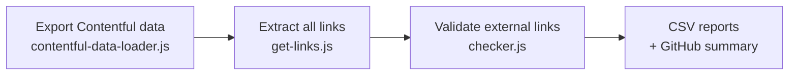

# Broken Link Checker

Validates all hyperlinks found in Contentful content. Exports the space data, extracts every link, checks external URLs with HTTP requests, and produces CSV reports of broken or suspicious links.

## How it works



1. **`contentful-data-loader.js`** — uses `export-processor` to fetch the full Contentful export and caches it to `export/contentful-data.json`. Delete this file to force a fresh export.
2. **`get-links.js`** — walks all rich text fields in entries tagged `e2e`, extracts every `hyperlink`, `entry-hyperlink`, and `asset-hyperlink` node, and writes them to `result/links.json`.
3. **`checker.js`** — reads `links.json`, fetches each external URL (15-second timeout), and splits results into:
   - `report/failed-external-links.csv` — external links that returned an error (403, 406, and 429 are treated as valid)
   - `report/internal-links-to-check.csv` — internal links (e.g. `/contact-us`) for manual review
   - A markdown summary posted to `GITHUB_STEP_SUMMARY` when running in GitHub Actions

## Running

```bash
cd contentful/broken-link-checker
npm install
npm run checker
```

## Configuration

Copy `.env.example` to `.env` and fill in:

| Variable | Description |
|---|---|
| `MANAGEMENT_TOKEN` | Contentful management API token |
| `SPACE_ID` | Contentful space ID |
| `CONTENTFUL_ENVIRONMENT` | Target environment (e.g. `master`, `work_in_progress`) |

## CI

This tool runs automatically in GitHub Actions. See `.github/workflows/broken-link-checker.yaml`.

## See also

- [Export processor](../export-processor/README.md) — provides the Contentful export this tool reads
- [Contentful tooling overview](../README.md)
- [GitHub Actions workflows](../../.github/README.md) — `broken-link-checker.yml` runs this in CI
