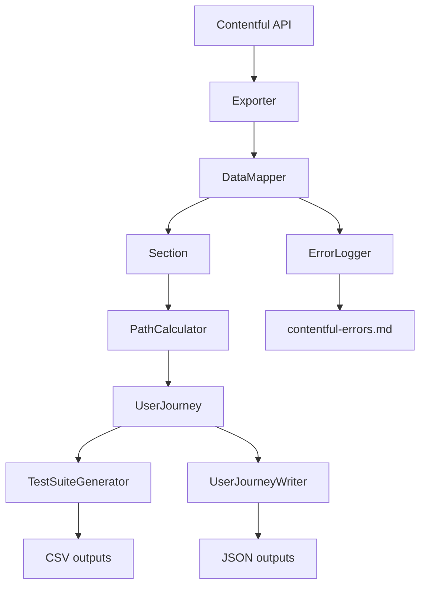

# Export Processor

A shared library and standalone tool for exporting Contentful data and processing it into various outputs: user journey paths, automated QA test suites, recommendations CSVs, and content validation reports.

Also used as a local package dependency by `broken-link-checker`.

## What it produces

| Output | Description |
|---|---|
| `plan-tech-test-suite.csv` | Manual QA test cases — one row per test step per subtopic |
| `plan-tech-test-suite-appendix.csv` | Supporting data for verifying test suite correctness |
| `<subtopic>-paths.json` | All possible user journey paths through a subtopic |
| `subtopic-paths-overview.json` | Summary statistics (journey counts per maturity, path lengths) |
| `recommendations.csv` | All recommendations mapped to answers, with staging preview links |
| `contentful-errors.md` | Validation report — missing references, unreachable questions, orphaned chunks |

## Architecture



The `DataMapper` is the core class. It takes a raw Contentful export, resolves all entry references (replacing IDs with actual content objects), and produces richly typed `Section`, `Question`, `Answer`, and `Recommendation` objects. The `PathCalculator` then walks the question graph to enumerate all possible user journeys.

## Running

```bash
cd contentful/export-processor
cp .env.example .env   # fill in values
npm install
```

| Command | What it does |
|---|---|
| `npm run generate-test-suites` | Export data and generate QA test suite CSVs |
| `npm run data-tools` | Export data, generate user journey paths, save errors (no test suites) |
| `npm run export-all-only` | Export raw Contentful data only — no processing |
| `npm run export-recommendations-csv` | Generate recommendations CSV (requires extended heap — see note below) |

### Environment variables

| Variable | Description |
|---|---|
| `MANAGEMENT_TOKEN` | Contentful management API token |
| `DELIVERY_TOKEN` | Contentful delivery API token |
| `SPACE_ID` | Contentful space ID |
| `ENVIRONMENT` | Target environment (e.g. `master`) |
| `USE_PREVIEW` | Export draft/preview content (`true`/`false`) |
| `SAVE_FILE` | Save exported Contentful data to JSON file (default: `true`) |
| `GENERATE_TEST_SUITES` | Generate QA test suite CSVs (default: `false`) |
| `EXPORT_USER_JOURNEY_PATHS` | Generate user journey path JSON files (default: `false`) |
| `EXPORT_ALL_PATHS` | Export all journeys, not just minimal set (default: `false`) |
| `OUTPUT_FILE_DIR` | Directory for output files (default: `./output/`) |
| `FUNCTION_APP_URL` | Webhook URL for `data-migrator.js` |

All variables except `FUNCTION_APP_URL` can also be passed as CLI arguments (which take precedence). Run `node data-tools.js --help` for the full list.

## Generated test suites

For each subtopic, the test suite covers 17 test scenarios including:

- Navigation and question answering
- Error handling (submitting without an answer)
- Partial completion and resume
- Blocking manual URL-ahead navigation
- Low, Medium, and High maturity recommendation paths
- Check answers, back button, and share page behaviour
- Footer link accessibility (accessibility, contact, cookies, privacy)
- 404 page rendering

## User journey paths

The minimum exported set per subtopic is:
- One or more paths covering all questions
- One path per maturity rating (Low, Medium, High)

Set `EXPORT_ALL_PATHS=true` to export every possible path.

## Content validation

`contentful-errors.md` is generated automatically and reports:
- Entries referenced by other entries that don't exist
- Questions with no path leading to them (orphaned questions)
- Maturity ratings with no possible journey in a subtopic
- Recommendation chunks with no answers attached

## Data Migrator

`data-migrator.js` posts content to the application's webhook in dependency order (entries with no outgoing references first). Requires `FUNCTION_APP_URL` in addition to the standard export variables.

```bash
node data-migrator.js
```

## Recommendations CSV

```bash
npm run export-recommendations-csv
```

Generates a CSV mapping every answer to its recommendation chunks, with staging preview links. The script runs with `--max-old-space-size=9000` due to the size of the data being processed.

## Tests

Tests for this project live in `../tests/tests/export-processor/`. Run from `/contentful`:

```bash
npm run test
```

## See also

- [Broken link checker](../broken-link-checker/README.md) — uses this as a local package dependency
- [QA visualiser](../qa-visualiser/README.md) — consumes exported data to generate flowcharts
- [Contentful tests](../tests/README.md) — test suite for this library
- [Contentful tooling overview](../README.md)
