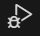

# Tests for Scripting Content Management

Tests can be debugged by setting up a 'Run and Debug' configuration in VS Code.

1. If it doesn't exist already, create the folder `.vscode` in the project root.
2. Create a file in `.vscode` named `launch.json` and copy the code below into it.

```
{
  "version": "0.2.0",
  "configurations": [
    {
      "type": "node",
      "request": "launch",
      "name": "Debug Jest Test",
      "program": "${workspaceFolder}/contentful/content-management/node_modules/jest/bin/jest.js",
      "args": [
        "tests/tests/export-processor/content-types/section.test.js",
        "--runInBand"
      ],
      "console": "integratedTerminal",
      "internalConsoleOptions": "neverOpen",
      "cwd": "${workspaceFolder}/contentful",
      "runtimeArgs": [
        "--experimental-vm-modules"
      ]
    }
  ]
}
```

4. Add one or more breakpoints to any of the `.test.js` files.
5. Click the 'Run and Debug' icon in the VSCode navigation menu. 
6. Select 'Debug Jest Test' from the drop down menu.
7. Click the green 'Play' button.