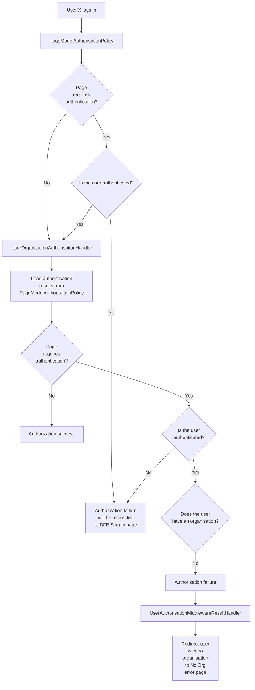

# Authentication

## Overview

Authentication for the web app is handled by DFE Signin, whilst authorisation is handled in our codebase.

Users require an organisation to view pages that require authentication.

## Authentication

DFE Signin authentication is handled by ASP .NET Core's built-in OIDC support.

It is setup in the [DfeSignInSetup.cs](/src/Dfe.PlanTech.Infrastructure.SignIn/DfeSignInSetup.cs) file.

We have various event callbacks to handle things such as recording user signins. These are in:
- [DfeOpenIdConnectEvents.cs](/src/Dfe.PlanTech.Infrastructure.SignIn/DfeOpenIdConnectEvents.cs)
- [OnUserInformationReceivedEvent.cs](/src/Dfe.PlanTech.Infrastructure.SignIn/ConnectEvents/OnUserInformationReceivedEvent.cs)

## Policies and Requirements

There are two authorization policies, each handled by their own custom AuthorizationHandler.

### [PageModelAuthorisationPolicy](/src/Dfe.PlanTech.Web/Authorisation/PageModelAuthorisationPolicy.cs)

This custom `AuthorizationHandler` handles the main part of the authorization.

As a lot of pages are loaded from our CMS, the authentication requirements are kept there (i.e. Contentful pages have a "Require authentication?" field).

`PageModelAuthorisationPolicy` checks whether the user's authentication matches the requirements specified for a given page from Contentful, and then approves/denies access based on the page's authentication requirements and the user's authenticaiton. If the user is authenticated as required by the page's settings, the policy will allow the request to proceed; otherwise, it will deny access.

### [UserOrganisationAuthorisationHandler](/src/Dfe.PlanTech.Web/Authorisation/UserOrganisationAuthorisationHandler.cs)

We also require each user be part of an organisation in DFE Signin. `UserOrganisationAuthorisationHandler` handles the authorization logic for user organization requirements.

This `AuthorizationHandler` loads up the page authentication requirements, and the user's authentication status, from the `PageModelAuthorisationPolicy` class. If the page requires authentication, but the user doesn't have an organisation attached to them, then this policy will deny access.

### [UserAuthorisationMiddlewareResultHandler](/src/Dfe.PlanTech.Web/Authorisation/UserAuthorisationMiddlewareResultHandler.cs)

The last piece is of the authorisation workflow. 

Since you cannot redirect from an `AuthorizationHandler`, we require some sort of middleware to handle redirecting users to the `no organisation error page` if appropriate. ASP .NET Core has a built in middleware that handles authorisation results, so this handler implements the interface for this.

This `IAuthorizationMiddlewareResultHandler` does two things:
- If the user's request resulted in a `forbidden` result, _and_ the result was thrown by the `UserOrganisationAuthorisationHandler`, then we redirect the user to the `no organisation error page`
- Otherwise, just return the result from the default `AuthorizationMiddlewareResultHandler`

## Diagrams

### Detailed Authorization Flow Diagram

## Detailed Steps

1. **User Requests Access**
   - A user attempts to access a protected resource.
  
2. **Authentication Check**
   - The application checks if the user is authenticated.
   - If not, the user is redirected to the login page.

3. **Page Authentication Requirement Check**
   - The application checks if the requested page requires authentication. This is done using `PageModelAuthorisationPolicy`.

4. **User Organisation Requirement Check**
   - If the page requires authentication, the application checks if the user belongs to an organization.
   - This is done using `UserOrganisationAuthorisationHandler`.

5. **Access Decision**
- If the user is not authenticated, they are redirected to the DFE Signin login page
- If the user is authenticated, and has an organisation, then access is granted.
- If the user is authenticated, but does not have an organisation, they are redirected the `no organisation error page`.

## See also

- [Customize the behavior of AuthorizationMiddleware (Microsft official documentation)
](https://learn.microsoft.com/en-us/aspnet/core/security/authorization/customizingauthorizationmiddlewareresponse?view=aspnetcore-8.0): an overview of how to implemen t a class that implements `IAuthorizationMiddlewareResultHandler`
- [Policy-based authorization in ASP.NET Core
 (Microsoft official documentation)](https://learn.microsoft.com/en-us/aspnet/core/security/authorization/policies?view=aspnetcore-8.0)