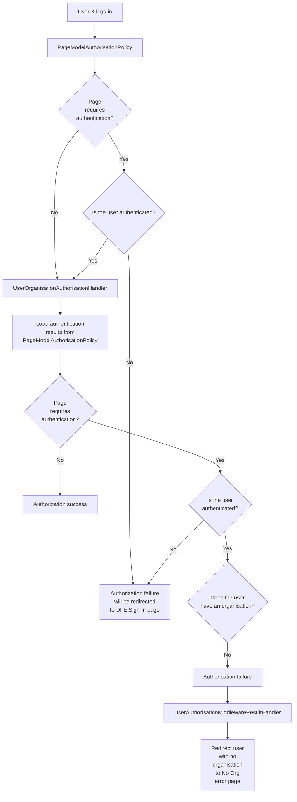

# Authentication

## Overview

- Handled by DSI

## Authorisation

```mermaid
graph TD
    A[User X logs in]
    A -->B[PageModelAuthorisationPolicy]
    B -->C{Page<br>requires<br>authentication?}
    C --"No"-->G
    C --"Yes"-->E{Is the user authenticated?}
    E --"No"-->F[Authorization failure<br>will be redirected<br>to DFE Sign In page]
    E --"Yes"-->G[UserOrganisationAuthorisationHandler]
    G -->H[Load authentication<br>results from<br>PageModelAuthorisationPolicy]
    H -->I{Page<br>requires<br>authentication?}
    I --"No"-->Z[Authorization success]
    I --"Yes"-->J{Is the user<br>authenticated?}
    J --"No"-->F
    J --"Yes"-->K{Does the user<br>have an organisation?}
    K --"No"-->L[Authorisation failure]
    L -->N[UserAuthorisationMiddlewareResultHandler]
    N -->O[Redirect user<br>with no<br>organisation<br>to No Org<br>error page]
```

## Requirements

## High level code overview

## See also

