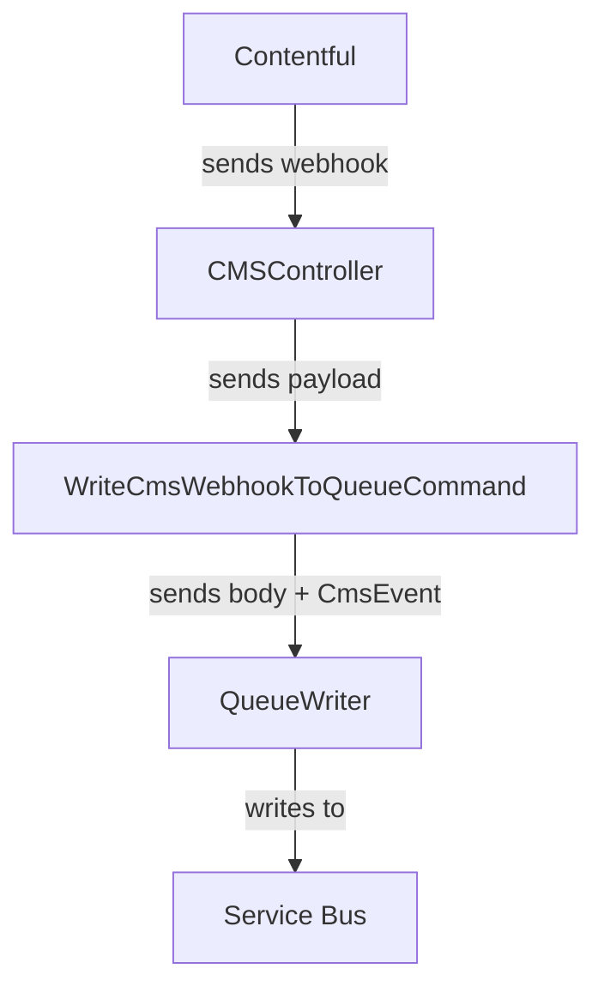
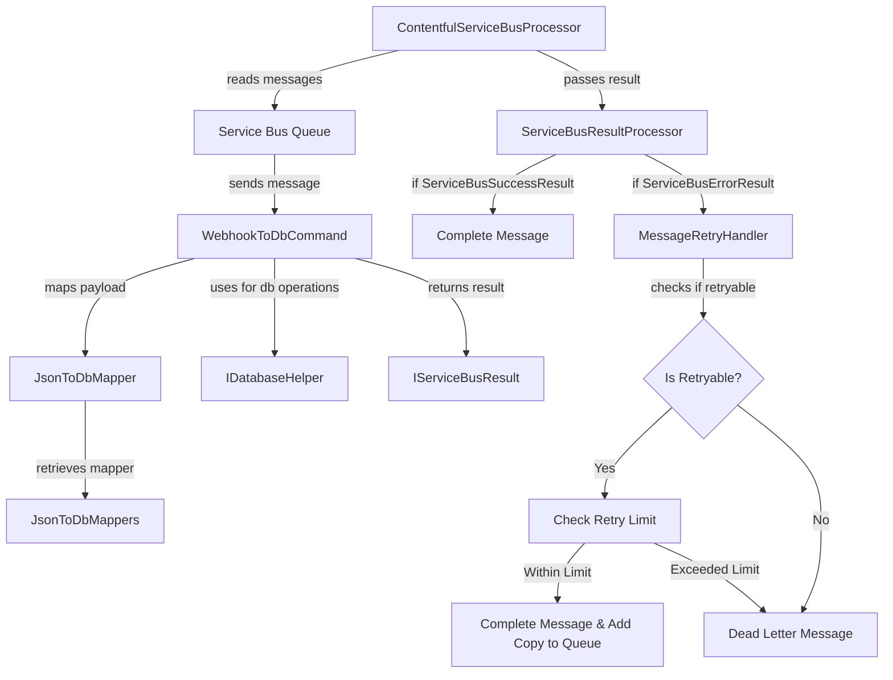

#  Contentful Caching via Database Process

## Overview

- Webhook posts to Azure function
- Azure function writes to queue
- Another Azure function reads from queue + writes to database
- Data is read from DB where applicable, if any failure then an attempt to load from Contentful is performed

## Contentful -> DB Process

### Webhook -> Queue

We have a webhook on Contentful setup for entries. The webhook is setup to trigger on all events (Create, Save, Autosave, Archive, Unarchive, Publish, Unpublish, Delete) for an entry. The webhook fires to a route on our webapp, which writes to a Service Bus queue for later processing.

### Queue -> DB

#### Mapping

- We normalise the incoming entry JSON. This involves essentially just copying the children within the "fields" object to a new JSON object, along with the "id" field from the "sys" object.
  - The end result of this is a JSON that should match the actual Contentful classes we use one-to-one.
- We then deserialise this JSON to the appropriate database class for the content type
- We retrieve the existing entity from our database, if it exists, using the id. 
  - If it does exist, we use reflection to copy over the values from the _incoming_ mapped entity, to the found _existing_ entity.
    - Certain properties are ignored during this, for a variety of reasons (e.g. they might be metadata, meaning they wouldn't exist on in the incoming data, which could cause errors or incorrect data copied over)
      - This is done by using our custom [DontCopyValueAttribute](./src/Dfe.PlanTech.Domain/DontCopyValueAttribute.cs) on each property we do not wish to copy, and checking for its existance per property
- Any relationship fields are mapped in the individual mapping classes per content type. If the relationship foreign key is on the _related_ entity, then we:
    - Create an object of that content type
    - Attach it to the EF Core context
    - Make the changes to the relationship field
  - This ensures that the changes to the relationship field are tracked by EF Core, without having to query the database for the existence of the row in the database
- We then save the changes in EF Core.

## DB Architecture

### Schema

### Functions

## Reading from database

We use EF Core as our ORM for reading/writing to the database. The DbContext used is [/src/Dfe.PlanTech.Infrastructure.Data/CmsDbContext.cs](/src/Dfe.PlanTech.Infrastructure.Data/CmsDbContext.cs).

### Mapping

AutoMapper is used for the majority of the mapping, as the DB models + Contentful models are 1-1 mapped for the vast majority of the fields/properties. The mapping profile for this is located in [/src/Dfe.PlanTech.Application/Mappings/MappingProfile.cs](/src/Dfe.PlanTech.Application/Mappings/MappingProfile.cs).

There are _some_ custom mappings done using LINQ `select` projections, due to various issues such as cyclical navigations with certain tables, or simply to limit what data is returned.

### Read navigation links

[/src/Dfe.PlanTech.Application/Content/Queries/GetNavigationQuery.cs] is where we retrieve navigation links for the footer. It is a simple query, merely returning the entire database table.

### Read page

[/src/Dfe.PlanTech.Application/Content/Queries/GetPageQuery.cs](/src/Dfe.PlanTech.Application/Content/Queries/GetPageQuery.cs) is responsible for retrieving Page data.

There are several steps to it:

1. We retrieve the `Page` matching the Slug from the table, and Include all `BeforeTitleContent` and `Content`. Note: there are various AutoIncludes defined in the [/src/Dfe.PlanTech.Infrastructure.Data/CmsDbContext.cs](/src/Dfe.PlanTech.Infrastructure.Data/CmsDbContext.cs) for the majority of the content tables, to ensure all data is pulled in.
  
2. Due to various issues with certain navigations, we execute various other queries and then merge the data together. These are completed using various `IGetPageChildrenQuery` objects that are injected into the `GetPageQuery` in the constructor using DI.

  -  If there is any content which has a `RichTextContent` property (using the `IHasText` interface to check), we execute a query to retrieve all the `RichTextContent` for the Page. The `RichTextMark` and `RichTextData` tables are joined automatically. This is handled by the [GetRichTextsQuery](/src/Dfe.PlanTech.Application/Content/Queries/GetRichTextsQuery.cs) class.
  
  - If there is any `ButtonWithEntryReference` content, then we retrieve the `LinkToEntry` property from it manually. This is to ensure we do not have a cartesian explosion (i.e. retrieving that entire page, + content, etc.), and to minimise the data we retrieve from the database (we only retrieve the slug and Id fields for the `LinkToEntry` property).  This is handled by the [GetButtonWithEntryReferencesQuery](/src/Dfe.PlanTech.Application/Content/Queries/GetButtonWithEntryReferencesQuery.cs) class.

  - If there are any `Category` content, we retrieve the `Sections` for them manually. This is because we also need to retrieve the `Question`s and `Recommendation`s for each Section, but only certain pieces of information. To prevent execessive data being retrieved, we only query the necessary fields. This is handled by the [GetCategorySectionsQuery](/src/Dfe.PlanTech.Application/Content/Queries/GetCategorySectionsQuery.cs) class.

3. We then use AutoMapper to map the database models to the Contentful models, as previously described.

## Caching

- Caching is handled by the open-source [EFCoreSecondLevelCacheInterceptor](https://github.com/VahidN/EFCoreSecondLevelCacheInterceptor) C# package.
- It is enabled only in the [web project](./src/Dfe.PlanTech.Web), and is enabled in the services configuration in [ProgramExtensions.cs](./src/Dfe.PlanTech.Web/ProgramExtensions.cs). We currently have no functionality setup to amend the configuration (e.g. caching length) via any sort of environment variables, but this should be added when possible.
- The Cache can be invalidated by an API key protected endpoint in the website. This is called by the azure function whenever content is updated in the database. The API key is stored in the key vault and referenced by an environment variable for the function.