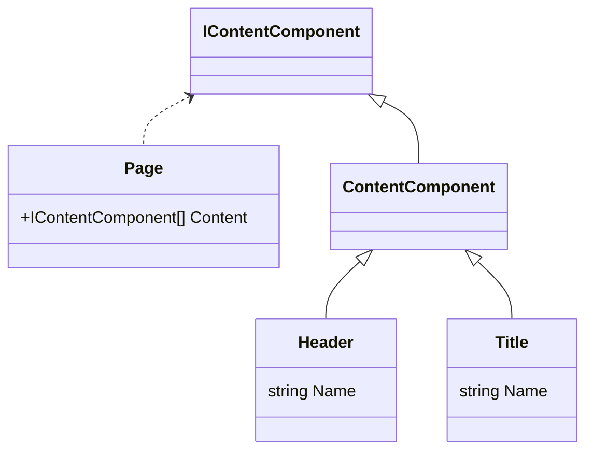

# Contentful Integration Overview

## Queries

Contentful queries are executed via the [ContentfulRepository](../src/Dfe.PlanTech.Infrastructure.Contentful/Persistence/ContentfulRepository.cs).

Individual query classes are stored in the [Dfe.PlanTech.Application](../src/Dfe.PlanTech.Application/) project. E.g. [Dfe.PlanTech.Application/Content/Queries/GetPageQuery.cs](../src/Dfe.PlanTech.Application/Content/Queries/GetPageQuery.cs).

## Views

Currently all views/partial views are stored in the `Views` folder in the [Dfe.PlanTech.Web](../src/Dfe.PlanTech.Web/Views/) project.

Any class that is mapped to a view should inherit the [ContentComponent](../src/Dfe.PlanTech.Domain/Content/Models/ContentComponent.cs) class, or the [IContentComponent](../src/Dfe.PlanTech.Domain/Content/Interfaces/IContentComponent.cs) interface that the former inherits.

To display this class on the page, either a full view should be created (e.g. the [Page view](../src/Dfe.PlanTech.Web/Views/Shared/Page.cshtml)), or a partial view (e.g. the [Header partial view](../src/Dfe.PlanTech.Web/Views/Shared/Components/Header.cshtml)).

### Partial Views

When creating a partial view, for dynamic page generation, the content type should be added to the [PageComponentFactory](../src/Dfe.PlanTech.Web/Views/Shared/Components/PageComponentFactory.cshtml) view.

_Note: This factory should likely be switched out to be a separate class, which can receive the different views via DI_

### Example Architecture

An example class overview. In this case, a `Page` class could display multiple types of content (in this instance, `Header` or `Title`), as both inherit the `ContentComponent` class.

The `Page` class has a view associated with it, and the `Header` and `Title` classes both have partial views. When the `Page` view is rendered, it loads each `IContentComponent` item within its `Content` array, and renders a partial view using the `PageComponentFactory.cshtml` partial view. This factory view, itself, then renders the correct partial view for each content object (via a simple switch statement + type checking).
