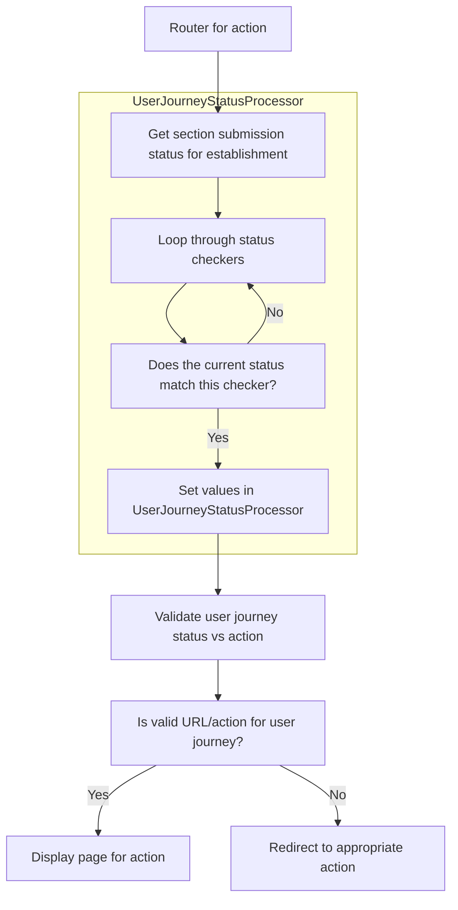
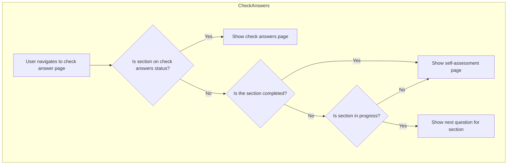
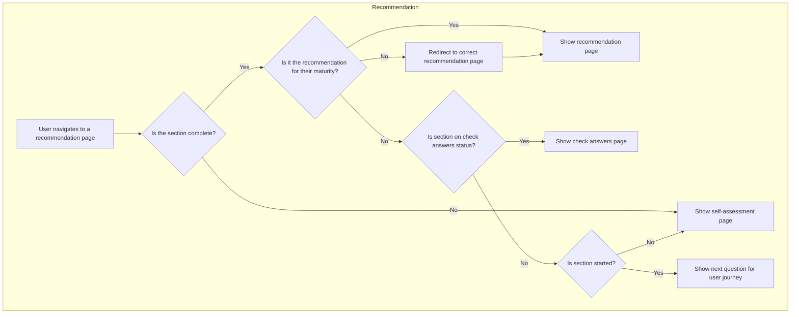
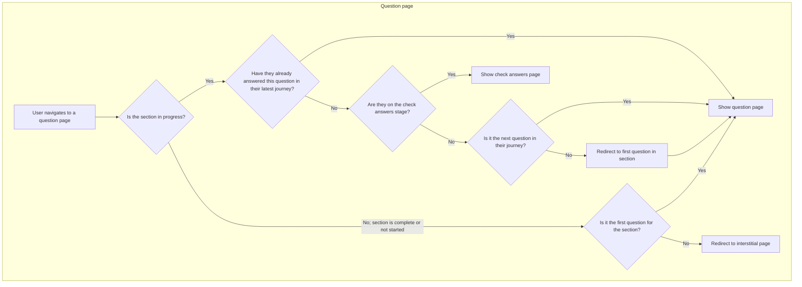

# Routing

Most routing is handled using conventional C# attributes. However, certain routes use extra classes/logic to ensure that the URL that is attempted to be loaded is a valid URL for the current stage of the establishment's user journey.

These classes are currently located in the [/src/Dfe.PlanTech.Web/Routing](/src/Dfe.PlanTech.Web/Routing) folder.

They are split into three main types:

1. `UserJourneyStatusProcessor` - this class loads shared information about the current user journey for the current section. E.g. whether it is completed or not, the next question in their journey, etc.
2. `UserJourneyStatusChecker`s - this class (and the implementations) are used by the above to determine the current status of a section for an establishment, and set various fields in the above `UserJourneyStatusProcessor` where appropriate
3. x`Router`s - these classes handle specific routing, page loading, etc. for actions. They validate that the action that is attempted to be navigated to is acceptable for the establishment's current status in the given section, and load the appropriate page if so. Otherwise, they redirect the user to a different page.

## Routing Logic

