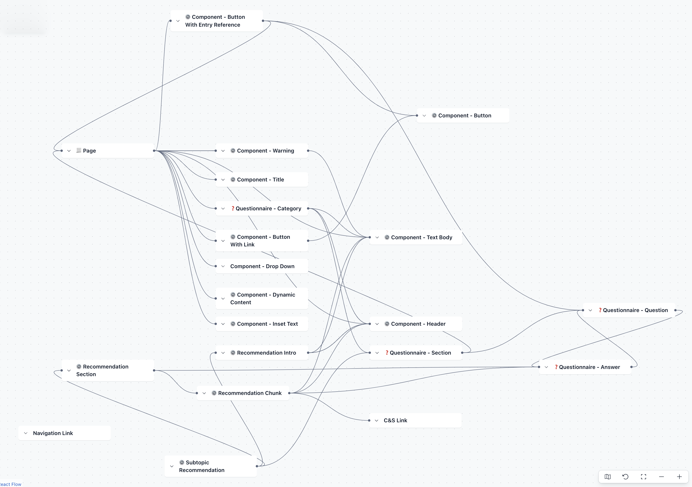

# Contentful

We use [Contentful](https://contentful.com/) as our CMS of choice.

## Content types

We have a wide number of content types, used for a variety of purposes.

Here is an overview of our Contentful content types:

## Reading and using Contentful data

Please read our [Contentful content usage](./contentful-content-usage.md) documentation to learn how we retrieve data from Contentful, how we map it to C# classes, use it in views, etc.

## Database

We store content from Contentful in our database, and retrieve content from our DB as our first port of call.

For more information read the [Contentful to DB](./contentful-to-db.md) documentation for an overview of why, and how, we save to the database.
Or our [database content](./db-content.md) documentation for information on how we store and retrieve the content.

## Caching

We cache content data that was retrieved by the DB in-memory in our web app.

Currently caching is handled by the open-source [EFCoreSecondLevelCacheInterceptor](https://github.com/VahidN/EFCoreSecondLevelCacheInterceptor) C# package.

It is enabled only in the [web project](./src/Dfe.PlanTech.Web), and is enabled in the services configuration in [ProgramExtensions.cs](./src/Dfe.PlanTech.Web/ProgramExtensions.cs). We currently have no functionality setup to amend the configuration (e.g. caching length) via any sort of environment variables, but this should be added when possible.
The Cache can be invalidated by an API key protected endpoint in the website. This is called by the azure function whenever content is updated in the database. The API key is stored in the key vault and referenced by an environment variable for the function.
