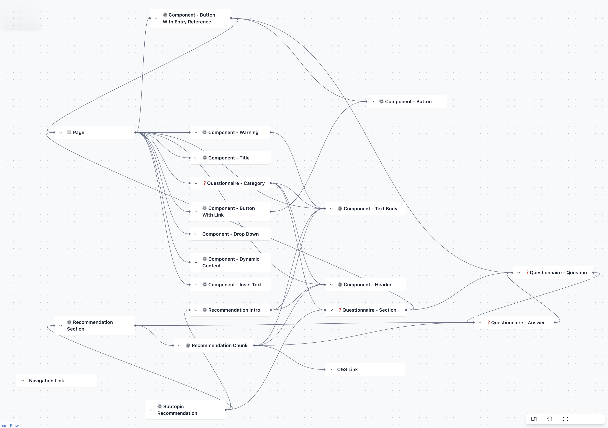

# Contentful

We use [Contentful](https://contentful.com/) as our CMS of choice.

## Content types

We have a wide number of content types, used for a variety of purposes.

Here is an overview of our Contentful content types:

## Reading and using Contentful data

Please read our [Contentful content usage](./contentful-content-usage.md) documentation to learn how we retrieve data from Contentful, how we map it to C# classes, use it in views, etc.

## Caching

We cache content data that was retrieved with a redis cache in our web app.

When content is cached, any nested content components within treat the parent component as a dependency.
If a child component needs invalidating, it is removed from the cache, as well as any of its depencencies.
This is explained in [contentful redis caching documentation](docs/cms/contentful-redis-caching.md)

## See also

- [Contentful tooling](../../contentful/README.md) — scripts for managing CMS content
- [Contentful data layer](../../src/Dfe.PlanTech.Data.Contentful/README.md) — how the application reads content at runtime
- [Redis cache infrastructure](../../src/Dfe.PlanTech.Infrastructure.Redis/README.md) — the caching layer
- [Content types and data usage](contentful-content-usage.md)
- [Redis caching strategy](contentful-redis-caching.md)
- [ADR 0019 — Contentful integration](../architecture-decision-record/0019-contentful-integration.md)
- [ADR 0041 — Redis cache](../architecture-decision-record/0041-redis-cache.md)
