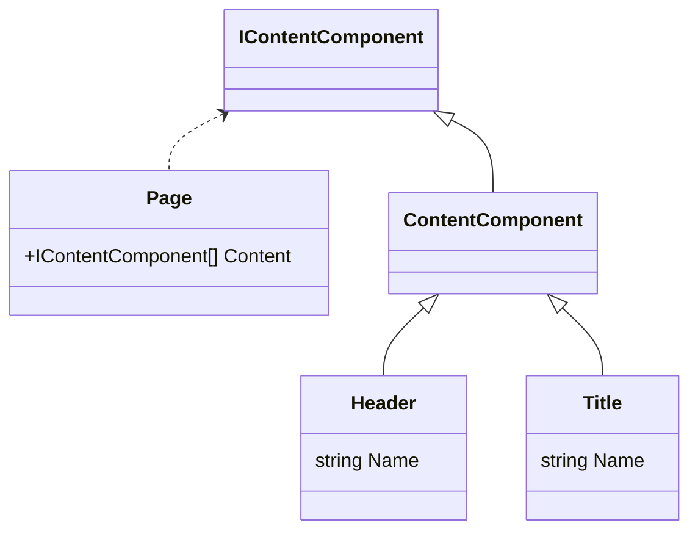

# Contentful Content Usage

## Querying

Contentful queries are executed via the [ContentfulRepository](/src/Dfe.PlanTech.Infrastructure.Contentful/Persistence/ContentfulRepository.cs).

Individual query classes are stored in the [Dfe.PlanTech.Application](/src/Dfe.PlanTech.Application/) project. E.g. [Dfe.PlanTech.Application/Content/Queries/GetPageQuery.cs](/src/Dfe.PlanTech.Application/Content/Queries/GetPageQuery.cs).

## Viewing

Currently all views/partial views are stored in the `Views` folder in the [Dfe.PlanTech.Web](/src/Dfe.PlanTech.Web/Views/) project.

Any class that is mapped to a view should inherit the [ContentComponent](/src/Dfe.PlanTech.Domain/Content/Models/ContentComponent.cs) class, or the [IContentComponent](/src/Dfe.PlanTech.Domain/Content/Interfaces/IContentComponent.cs) interface that the former inherits.

To display this class on the page, either a full view should be created (e.g. the [Page view](/src/Dfe.PlanTech.Web/Views/Shared/Page.cshtml)), or a partial view (e.g. the [Header partial view](/src/Dfe.PlanTech.Web/Views/Shared/Components/Header.cshtml)).

### Partial Views, Classes, Components, etc.

- Each `Content Type` in Contentful should have a matching class for it.
  - The `Content Type Id` should match the class name. E.g. for a Content Type with Id `header` there should be a class called `Header`

- Each class should have a matching view, in the `/Views/Shared` folder. The view should match the name of the class.
  - E.g. a `Header` class has a `Header.cshtml` view located under `/Views/Shared/Components/Header.cshtml`

- There is a [ComponentViewsFactory](/src/Dfe.PlanTech.Web/Helpers/ComponentViewsFactory.cs) for finding/loading/displaying the views for each component
- As hinted at above, it gets the type name of the model that it is trying to be created, and attempts to find a matching view for it within the `Views/Shared` location.

### Example Architecture

An example class overview. In this case, a `Page` class could display multiple types of content (in this instance, `Header` or `Title`), as both inherit the `ContentComponent` class.

The `Page` class has a view associated with it, and the `Header` and `Title` classes both have partial views. When the `Page` view is rendered, it loads each `IContentComponent` item within its `Content` array, and renders a partial view using the `PageComponentFactory.cshtml` partial view. This factory view, itself, then renders the correct partial view for each content object (via a simple switch statement + type checking).
