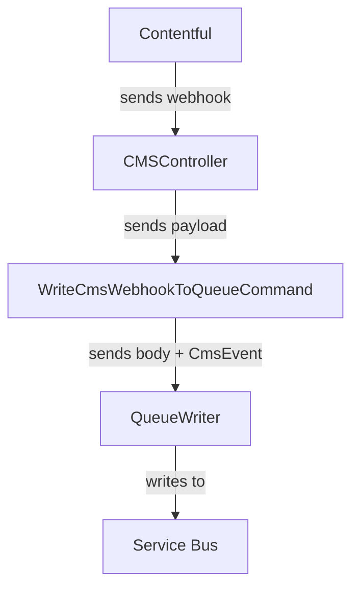
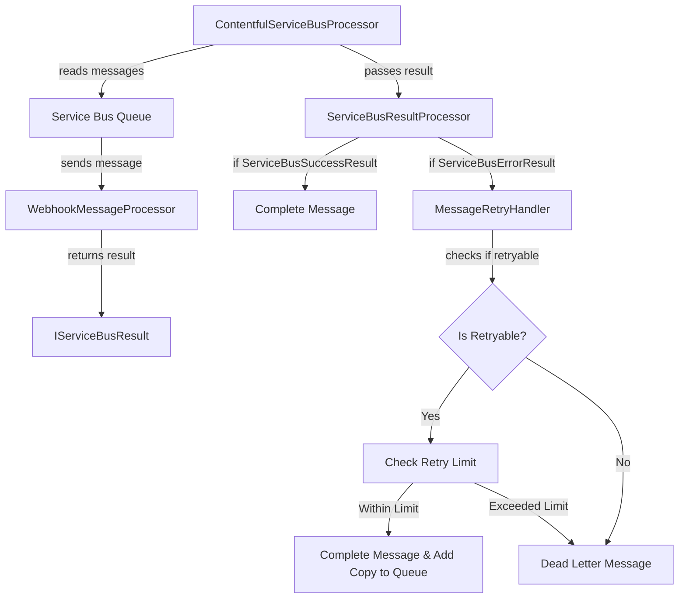

# Contentful Caching

## Overview

We save content from Contentful in a redis cache to:
1. Reduce calls to Contentful to avoid rate limiting
2. Caching data for improved performance

## Processes

### Retrieving data from Contentful

Whenever data is retrieved from Contentful, it is done so with the method `GetOrCreateAsync` to use the value in the redis cache if there is one,
otherwise fetch the data from Contentful and store what is retrieved in the cache.

At the time of storing a item of Content in the cache, its dependencies are also stored.
These are obtained by recursively going through the properties of the component and for every other nested Content component, making the parent a dependency.
This way if a child item is modified and the cache needs invalidating, the parent can also be removed from the cache.

### Cache Invalidation

We have setup webhooks on Contentful that fire under certain status changes to content types (e.g. content is created, or saved, etc.).
This webhook points to a route on our web app. We then save the webhook payload to an Azure Service Bus queue, with minimal to no validation.

A second process, using a `BackgroundService` hosted on the web app, reads messages from the queue, processes them to get a CMS payload, and uses that to determine which cache items to remove.

When a piece of content is updated, that content will be removed from the cache, as well as any of its dependencies, and the dependency array will then also be removed from the cache as it is no longer applicable.

## Processes

### Webhook -> Queue

We have a webhook on Contentful setup for entries. The webhook is setup to trigger on all events (Create, Save, Autosave, Archive, Unarchive, Publish, Unpublish, Delete) for an entry. The webhook fires to a route on our web app, which writes to a Service Bus queue for later processing.

### Queue -> WebhookMessageProcessor

