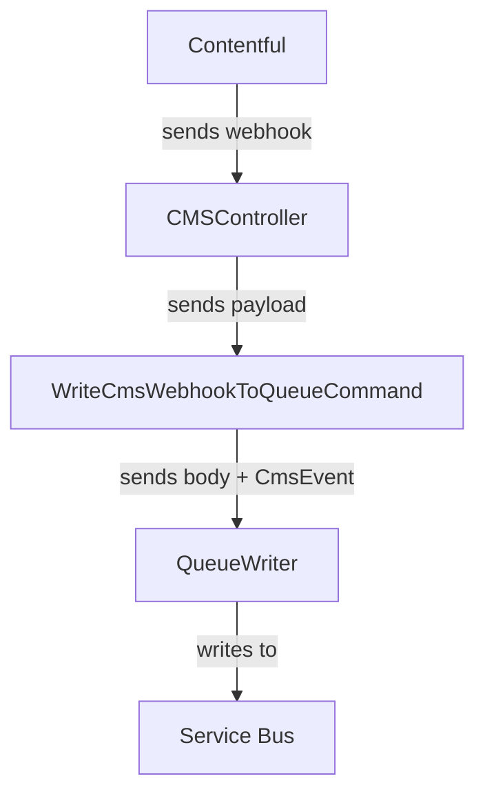
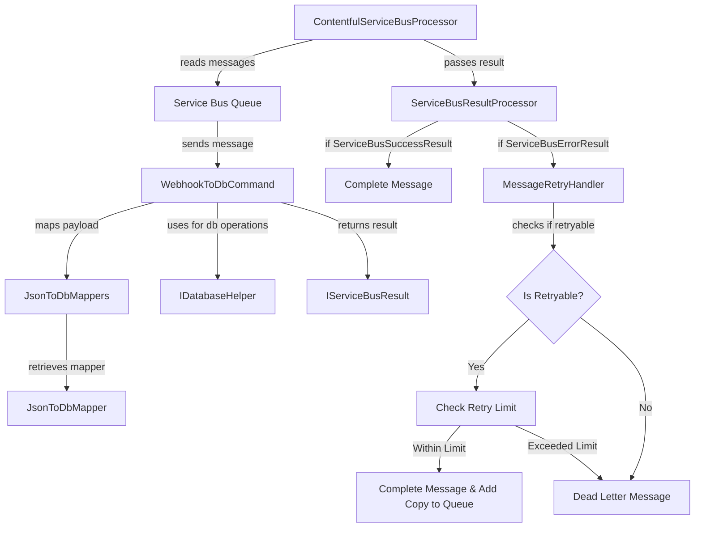

# Contentful -> DB

## Overview

We save content from Contentful in our database for various purposes, the main ones being:
1. Reduce calls to Contentful to avoid rate limiting
2. Caching data 

To do this, we have setup webhooks on Contentful that fire under certain status changes to content types (e.g. content is created, or saved, etc.).
This webhook points to a route on our web app. We then save the webhook payload to an Azure Service Bus queue, with minimal to no validation.

A second process, using a `BackgroundService` hosted on the web app, reads messages from the queue, processes them (e.g. validation, mapping them to the relevant DB class for the content, etc.), and updates the database.

When using content on our webapp, we read from the DB using EF Core. If there is a failure for whatever reason (e.g. connection issues, or even just content not being found that was requested), then we attempt to retrieve the same content from Contentful.

## Processes

### Webhook -> Queue

We have a webhook on Contentful setup for entries. The webhook is setup to trigger on all events (Create, Save, Autosave, Archive, Unarchive, Publish, Unpublish, Delete) for an entry. The webhook fires to a route on our web app, which writes to a Service Bus queue for later processing.

### Queue -> DB

## Mapping

- We normalise the incoming entry JSON. This involves essentially just copying the children within the "fields" object to a new JSON object, along with the "id" field from the "sys" object.
  - The end result of this is a JSON that should match the actual Contentful classes we use one-to-one.
- We then deserialise this JSON to the appropriate database class for the content type
- We retrieve the existing entity from our database, if it exists, using the id. 
  - If it does exist, we use reflection to copy over the values from the _incoming_ mapped entity, to the found _existing_ entity.
    - Certain properties are ignored during this, for a variety of reasons (e.g. they might be metadata, meaning they wouldn't exist on in the incoming data, which could cause errors or incorrect data copied over)
      - This is done by using our custom [DontCopyValueAttribute](./src/Dfe.PlanTech.Domain/DontCopyValueAttribute.cs) on each property we do not wish to copy, and checking for its existance per property
- Any relationship fields are mapped in the individual mapping classes per content type. If the relationship foreign key is on the _related_ entity, then we:
    - Create an object of that content type
    - Attach it to the EF Core context
    - Make the changes to the relationship field
  - This ensures that the changes to the relationship field are tracked by EF Core, without having to query the database for the existence of the row in the database
- We then save the changes in EF Core.

