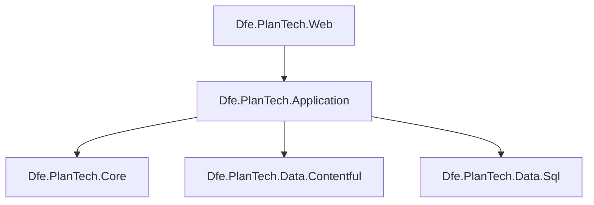
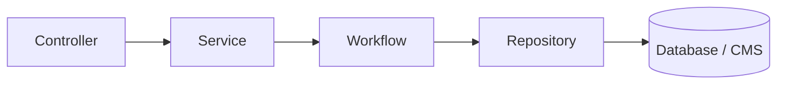
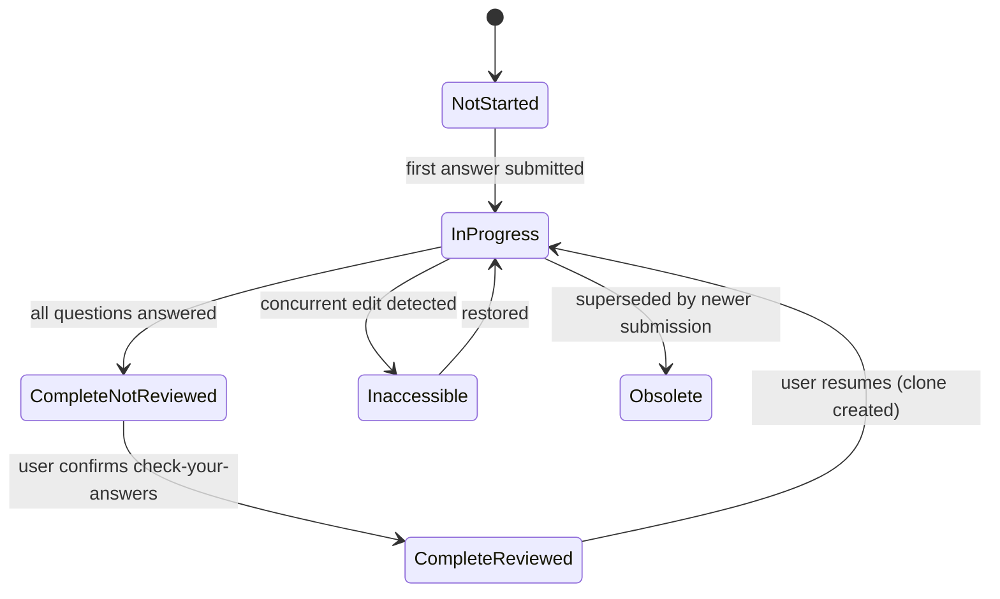

# Dfe.PlanTech.Application

The application layer for Plan Technology for Your School. Contains all business logic, service interfaces, and rich text rendering. Sits between the presentation layer and the data layers, orchestrating content retrieval, questionnaire submission, recommendations, and user management.

## Target framework

.NET 9.0

## Dependencies

| Package | Purpose |
|---|---|
| `Microsoft.AspNetCore.Http.Abstractions` | HTTP context access, used by cookie and rendering services |
| `Dfe.PlanTech.Core` | Shared models, interfaces, constants, enums |
| `Dfe.PlanTech.Data.Contentful` | CMS content retrieval |
| `Dfe.PlanTech.Data.Sql` | Database persistence via stored procedures |

## Architecture position



## Structure

### `Services/` and `Workflows/`

Business logic is split across two layers:

- **Workflows** orchestrate repositories and implement the actual logic. They are the substance.
- **Services** are facades over workflows, providing a stable interface to the presentation layer.



| Service | Workflow | Responsibility |
|---|---|---|
| `ContentfulService` | `ContentfulWorkflow` | Fetch pages, sections, questions, recommendations, and microcopy from Contentful |
| `EstablishmentService` | `EstablishmentWorkflow` | Create/retrieve schools and multi-academy trust links |
| `SubmissionService` | `SubmissionWorkflow` | Full questionnaire submission lifecycle |
| `RecommendationService` | `RecommendationWorkflow` | Recommendation status history (event log) |
| `UserService` | `UserWorkflow` | User lookup and preference settings |
| `CookieService` | `CookieWorkflow` | Cookie consent — reads, writes, and cleans up non-essential cookies |
| — | `SignInWorkflow` | Records a DfE Sign-in event, creating user and establishment records as needed |

#### Submission lifecycle

The submission workflow manages a state machine across the questionnaire journey:



### `Rendering/`

Converts Contentful rich text JSON to HTML. Uses a **strategy pattern** — `RichTextRenderer` holds a collection of `BaseRichTextContentPartRenderer` implementations, each responsible for one node type.

| Renderer | Node type | Output |
|---|---|---|
| `ParagraphRenderer` | `paragraph` | `<p>` |
| `HeadingRenderer` | `heading-1` … `heading-6` | `<h1>` … `<h6>` |
| `TextRenderer` | `text` | Inline text with mark wrapping (`<b>`, `<i>`, etc.) |
| `HyperlinkRenderer` | `hyperlink` | `<a href="...">` — external links get "(opens in new tab)" |
| `UnorderedListRenderer` | `unordered-list` | `<ul>` |
| `OrderedListRenderer` | `ordered-list` | `<ol>` |
| `ListItemRenderer` | `list-item` | `<li>` |
| `TableRenderer` | `table` | `<table class="govuk-table">` |
| `TableRowRenderer` | `table-row` | `<tr>` with `<thead>`/`<tbody>` management |
| `TableHeaderCellRenderer` | `table-header-cell` | `<th class="govuk-table__header">` |
| `TableCellRenderer` | `table-cell` | `<td class="govuk-table__cell">` |
| `EmbeddedEntryBlockRenderer` | `embedded-entry-block` | Delegates to attachment or accordion renderer |
| `AttachmentComponentRenderer` | Contentful attachment entry | File download link with icon, type, and size |
| `AccordionComponentRenderer` | Contentful accordion entry | GOV.UK accordion markup |
| `CardComponentRenderer` | Contentful card entry | `<div class="dfe-card">` |
| `GridContainerRenderer` | Contentful grid container entry | `<div class="dfe-grid-container">` |

New renderers can be added by subclassing `BaseRichTextContentPartRenderer` and registering via `SetupRichTextRenderers()` — no changes to `RichTextRenderer` itself are needed.

### `Configuration/`

Thirteen focused configuration classes bound from `appsettings.json`, covering:

| Class | Covers |
|---|---|
| `ApiAuthenticationConfiguration` | API key validation |
| `ContentSecurityPolicyConfiguration` | CSP header sources |
| `DfeSignInConfiguration` | OAuth settings for DfE Sign-in |
| `ContentfulOptionsConfiguration` | Preview vs. production environment |
| `GoogleTagManagerConfiguration` / `TrackingOptionsConfiguration` | GTM and Clarity IDs |
| `RobotsConfiguration` | `robots.txt` rules |
| `ErrorMessagesConfiguration` / `ErrorPagesConfiguration` | Error content |
| `ContactOptionsConfiguration` | Contact link |
| `SigningSecretConfiguration` | Data integrity signing |
| `SupportedAssetTypesConfiguration` | Whitelisted file types for uploads |

### `Background/`

`IBackgroundTaskQueue` defines an async work queue backed by `System.Threading.Channels`, used for fire-and-forget background processing. `BackgroundTaskQueueOptions` configures the maximum queue depth and overflow behaviour.

## Service registration

All services, workflows, and renderers are registered via extension methods in `ServiceCollectionExtensions.cs`:

```csharp
services.SetupRichTextRenderers();
services.AddApplicationServices();
services.AddApplicationWorkflows();
```
