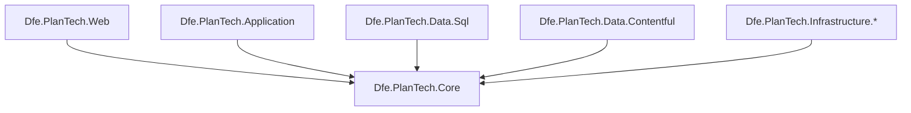

# Dfe.PlanTech.Core

Shared core library for the Plan Technology for Your School application. Contains the models, interfaces, constants, helpers, and DTOs used across all other projects in the solution.

## Target framework

.NET 9.0

## Dependencies

| Package | Purpose |
|---|---|
| `contentful.csharp` | Contentful CMS SDK — used by content entry models and query builders |
| `Microsoft.Extensions.Logging.Abstractions` | Logging abstractions |

## Structure

### `Attributes/`
Custom attributes used elsewhere in the solution:
- `ContentfulTypeAttribute` — marks a class with its Contentful content type ID
- `CssClassAttribute` — marks an enum value with its corresponding CSS class name

### `Caching/`
Interfaces and models for the caching layer. `ICacher` and `ICmsCache` define in-memory caching contracts; `IDistributedCache` extends this for distributed scenarios with pub/sub and set support. `IQuestionnaireCache` and `QuestionnaireCacher` handle questionnaire-specific session caching.

### `Constants/`
Application-wide string constants covering:
- `ClaimConstants` — JWT claim names, including custom DfE claims for DB user/establishment IDs
- `ConfigurationConstants` — configuration section paths (Contentful, Database, DfE Sign-in, GTM, etc.)
- `ContentfulContentTypeConstants` — maps every Contentful content type ID to its C# class
- `ContentfulMicrocopyConstants` — keys and variable placeholders for CMS-managed UI text
- `DatabaseConstants` — stored procedure names and parameter names
- `DsiConstants` — DfE Sign-in organisation category and establishment type IDs
- `UrlConstants` — application route constants

### `Contentful/`
Everything needed to work with content from Contentful:

- **`Enums/`** — `HeaderSize`, `HeaderTag`, `MarkType`, `RichTextNodeType`
- **`Interfaces/`** — contracts for rich text rendering (`IRichTextRenderer`, `IRichTextContentPartRenderer`, `IRichTextContentPartRendererCollection`), content entry identity (`IContentfulEntry`, `IHasSlug`, `IHasUri`), and card rendering
- **`Models/`** — concrete entry classes for every content type: pages, questionnaire sections/questions/answers, recommendation pages and chunks, all UI component types (accordion, button, card, header, hero, inset text, warning, etc.), microcopy, and rich text fields. All inherit from the abstract `ContentfulEntry` base class.
- **`Options/`** — options objects for page retrieval and rich text rendering
- **`Queries/`** — `ContentfulQuery` and related classes for building typed Contentful API queries, plus `QueryBuilderExtensions`

### `DataTransferObjects/Sql/`
DTOs used to transfer data between the application and SQL stored procedures. Each `Sql*Dto` maps to a specific stored procedure result set or parameter set:

| DTO | Purpose |
|---|---|
| `SqlUserDto` | Authenticated user record |
| `SqlSubmissionDto` | Questionnaire submission |
| `SqlResponseDto` | Individual answer response within a submission |
| `SqlEstablishmentDto` | School or establishment record |
| `SqlAnswerDto` / `SqlQuestionDto` | Answer and question definitions |
| `SqlRecommendationDto` | Recommendation item |
| `SqlEstablishmentRecommendationHistoryDto` | Recommendation history per establishment |
| `SqlSectionStatusDto` | Completion status of a questionnaire section |
| `SqlUserSettingsDto` | User preference settings |

### `Enums/`
Domain enumerations:
- `Maturity` — `Unknown`, `Low`, `Medium`, `High`
- `RecommendationStatus` — `NotStarted`, `InProgress`, `Complete`
- `RecommendationSortOrder` — `Default`, `Status`, `LastUpdated`
- `SubmissionStatus` — full lifecycle from `None` through `CompleteReviewed`, plus `Inaccessible`, `Obsolete`, `RetrievalError`
- `EstablishmentType` — 40+ school types (Academy, Free School, Grammar, etc.)
- `OrganisationCategory` — Establishment, MAT, LAT, Government, Software Supplier, etc.
- `CookieAcceptOption` — `NotSet`, `Reject`, `Accept`

### `Exceptions/`
Custom exception types for specific failure scenarios:

| Exception | When thrown |
|---|---|
| `ContentfulDataUnavailableException` | CMS content could not be retrieved |
| `DatabaseException` | A database operation failed |
| `GetEntriesException` | Contentful API entry retrieval failed |
| `GuardException` | A guard clause validation failed |
| `InvalidEstablishmentException` | An establishment reference is invalid |
| `LockException` | A distributed lock timed out |
| `MissingServiceException` | A required DI service was not registered |
| `UserJourneyMissingContentException` | Content required for the user journey is absent |

### `Extensions/`
Extension methods on standard types:
- `StringExtensions` — slugify, capitalise, non-breaking hyphen insertion, HTML decode
- `StringBuilderExtensions` — efficient `EndsWith` check
- `EnumExtensions` — parse enums by display name, retrieve CSS class attribute values
- `ContentComponentJsonExtensions` — polymorphic JSON deserialisation for Contentful content entries

### `Helpers/`
Stateless helper classes:
- `ContentfulContentTypeHelper` — resolves a C# type to its Contentful content type ID via `ContentfulTypeAttribute`
- `ContentfulMicrocopyHelper` — retrieves and interpolates CMS microcopy strings
- `DateTimeHelper` / `TimeZoneHelper` — date formatting and UTC→UK timezone conversion
- `RecommendationSortHelper` / `RecommendationStatusHelper` / `RecommendationSorter` — sort and status logic for recommendations
- `SubmissionHelper` — parses submission status from strings
- `ReflectionHelper` — type discovery utilities (find all concrete subtypes, check if a type is concrete)
- `RandomNumberHelper` — cryptographically secure random integer generation
- `TagColourHelper` — maps colour strings to valid CSS colour values

### `Models/`
Business-layer models that bridge the CMS and database layers:
- `EstablishmentModel` — school/establishment in the context of the current user session
- `SubmissionResponsesModel` / `AssessmentResponseModel` — completed questionnaire data
- `QuestionWithAnswerModel` — a single question paired with its chosen answer
- `SubmissionInformationModel` — submission with its section context
- `RoutingInformationModel` — routing/navigation state
- `DfeCookieModel` — cookie consent state
- `PaginationModel` — pagination parameters
- `UserGroupSelectionModel` — MAT/group school selection state

### `Options/`
Configuration options classes bound from `appsettings.json`:
- `DatabaseOptions` — connection string and timeout settings
- `AutomatedTestingOptions` — flags for test environment behaviour

## Architecture

This library sits at the base of the dependency graph. It has no references to other projects in the solution — all other projects reference it, not the other way round.

## See also

- [Application layer](../Dfe.PlanTech.Application/README.md) — primary consumer of Core services and interfaces
- [Contentful data layer](../Dfe.PlanTech.Data.Contentful/README.md) — uses Core entry models
- [SQL data layer](../Dfe.PlanTech.Data.Sql/README.md) — uses Core DTOs and entities
- [CMS content types and data usage](../../docs/cms/contentful-content-usage.md) — how Core's Contentful models are used
