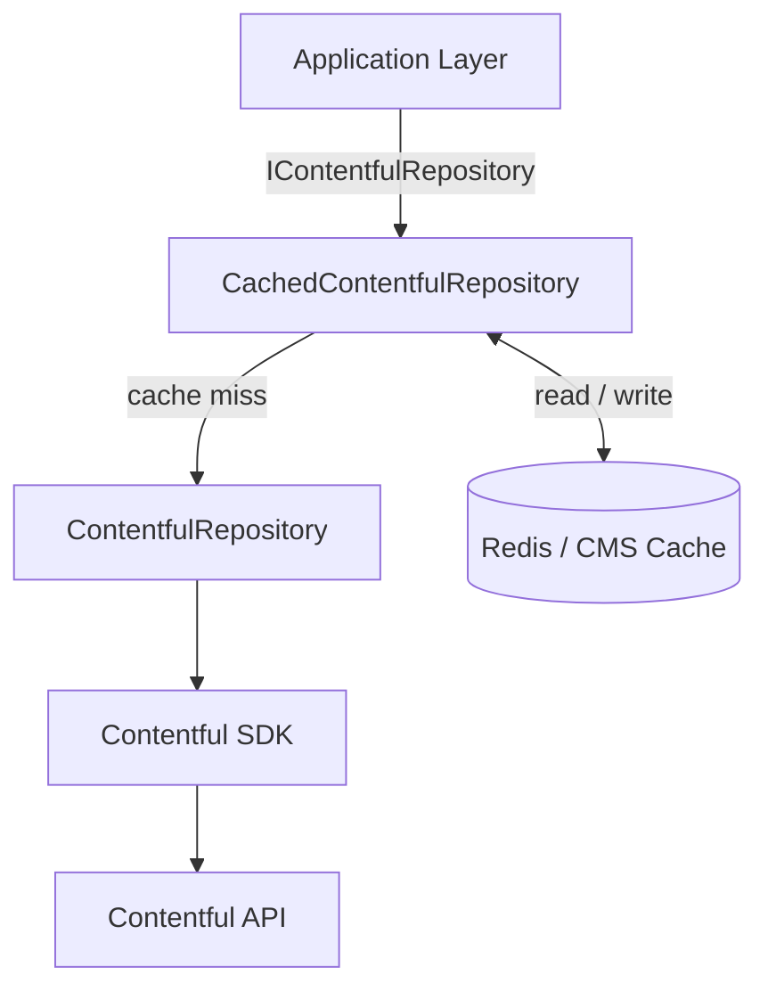

# Dfe.PlanTech.Data.Contentful

The Contentful CMS data access layer for Plan Technology for Your School. Retrieves content from the Contentful Delivery and Preview APIs, handles polymorphic deserialisation of content entries, and wraps all queries in a caching layer to reduce API usage.

## Target framework

.NET 9.0

## Dependencies

| Package | Purpose |
|---|---|
| `contentful.csharp` | Official Contentful SDK — `IContentfulClient`, query builders, type resolution |
| `Microsoft.Extensions.Hosting.Abstractions` | `IHostEnvironment` for environment-aware test content filtering |
| `Microsoft.Extensions.Http` | `HttpClient` factory for the Contentful HTTP client |
| `Dfe.PlanTech.Core` | Shared entry models, content type constants, query builders, cache interfaces |

## Architecture

The project has two repository implementations of `IContentfulRepository`, composed using the decorator pattern. Consumers always receive the cached version; the inner repository is accessible via a keyed DI service.



## Components

### `IContentfulRepository`

The single interface consumed by the application layer. Provides:

| Method | Purpose |
|---|---|
| `GetEntryByIdAsync<TEntry>` | Fetch one entry by its Contentful system ID |
| `GetEntriesAsync<TEntry>()` | Fetch all entries of a type |
| `GetEntriesAsync<TEntry>(options)` | Fetch entries with filtering/sorting/include-depth options |
| `GetPaginatedEntriesAsync<TEntry>(options)` | Fetch a single page of results |
| `GetEntriesCountAsync<TEntry>()` | Return the total entry count without fetching content |
| `GetEntryByIdOptions` | Build a `GetEntriesOptions` for a single ID lookup |

### `ContentfulRepository`

The base implementation. Wraps `IContentfulClient` and handles:

- **Query construction** — delegates to `QueryBuilders` from `Dfe.PlanTech.Core`
- **Test content filtering** — excludes content tagged for testing in production, or when `AutomatedTestingOptions` opts out
- **Error handling** — logs any partial errors returned in the `ContentfulCollection` without throwing (Contentful can return results alongside errors for unresolvable references)
- **Include depth** — all queries default to `include=2`; callers can override per query

### `CachedContentfulRepository`

A decorator over `ContentfulRepository`. Adds a cache-aside layer using `ICmsCache`:

| Method | Cached? | Cache key |
|---|---|---|
| `GetEntriesAsync<TEntry>()` | Yes | `{contentTypeName}s` |
| `GetEntriesAsync<TEntry>(options)` | Yes | `{contentTypeName}{serialisedOptions}` |
| `GetEntryByIdAsync<TEntry>` | Yes (via options cache) | `{contentTypeName}{serialisedOptions}` |
| `GetPaginatedEntriesAsync` | No | — |
| `GetEntriesCountAsync` | No | — |

### `EntryResolver`

Implements Contentful's `IContentTypeResolver`. When the SDK deserialises a response, it calls `Resolve(contentTypeId)` for each entry to determine the target C# type:

1. Checks `ContentfulContentTypeConstants.ContentTypeToEntryClassTypeMap` for an explicit match
2. Falls back to a reflection-built dictionary of all types inheriting from `ContentfulEntry`
3. Returns `MissingComponentEntry` for any unknown content type, rather than throwing

### `DependencyInjectionContractResolver`

A custom Newtonsoft.Json `DefaultContractResolver` that, when deserialising a type that is registered in the DI container, uses the registered instance as the deserialisation target rather than constructing a new one. This allows DI-managed objects to receive injected dependencies during deserialisation.

## Service registration

```csharp
services.SetupContentfulClient(configuration, addRetryPolicy);
```

This registers:

| Service | Implementation | Lifetime |
|---|---|---|
| `ContentfulOptions` | — (bound from config) | Singleton |
| `IContentfulClient` | `ContentfulClient` | Scoped |
| `IContentfulRepository` (keyed: `ContentfulRepository`) | `ContentfulRepository` | Scoped |
| `IContentfulRepository` (default) | `CachedContentfulRepository` | Scoped |

The `addRetryPolicy` parameter is an `Action<IHttpClientBuilder>` — the caller (typically `Dfe.PlanTech.Web`) supplies the HTTP retry policy for the Contentful HTTP client.

## Configuration

| Key | Required | Description |
|---|---|---|
| `Contentful:DeliveryApiKey` | Yes | Contentful Content Delivery API key |
| `Contentful:PreviewApiKey` | Yes | Contentful Content Preview API key |
| `Contentful:SpaceId` | Yes | Contentful space ID |
| `Contentful:SigningSecret` | Yes | Secret used to validate Contentful webhook signatures |
| `Contentful:UsePreviewApi` | No | `true` to use the Preview API (defaults to Delivery) |
| `Contentful:Environment` | No | Contentful environment name (defaults to `master`) |

On non-Windows hosts, replace `:` with `__` in key names (e.g. `Contentful__SpaceId`).

For local development it is recommended to use [dotnet user-secrets](https://learn.microsoft.com/en-us/aspnet/core/security/app-secrets) rather than environment variables:

```shell
dotnet user-secrets set Contentful:SpaceId SPACEID
```
