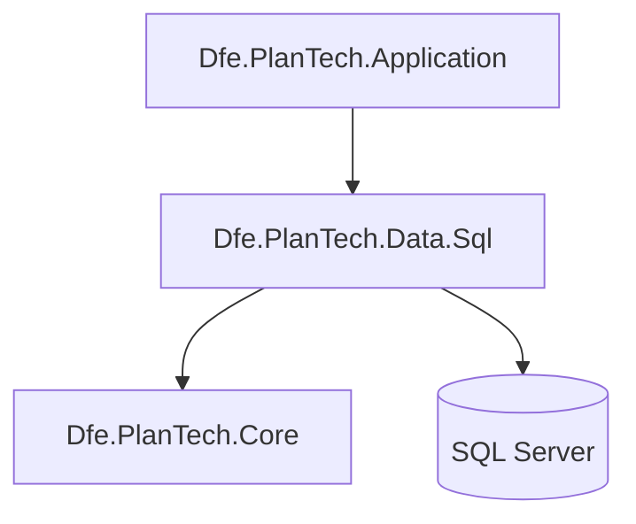
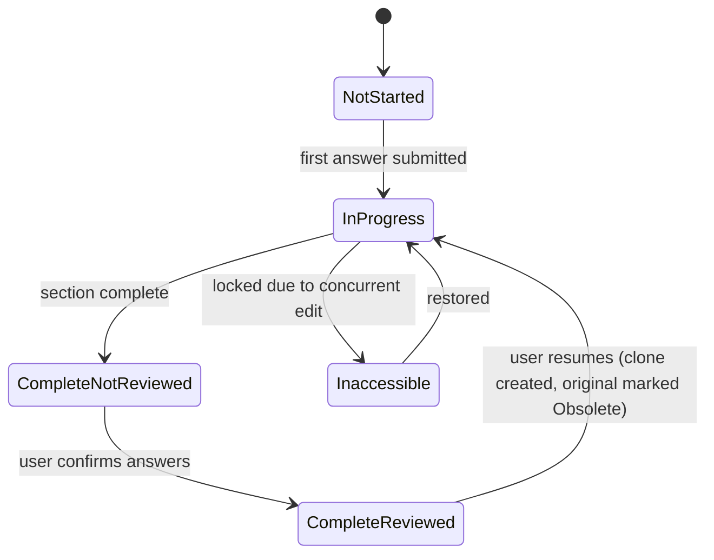

# Dfe.PlanTech.Data.Sql

The SQL Server data access layer for Plan Technology for Your School. Contains the EF Core `DbContext`, all entity definitions, entity type configurations, and repository implementations.

## Target framework

.NET 9.0

## Dependencies

| Package | Purpose |
|---|---|
| `Microsoft.EntityFrameworkCore.SqlServer` | EF Core SQL Server provider |
| `Microsoft.AspNetCore.DataProtection.EntityFrameworkCore` | Stores ASP.NET Core Data Protection keys via EF Core |
| `Microsoft.Extensions.Configuration.Binder` | Binds `DatabaseOptions` from configuration |
| `Dfe.PlanTech.Core` | Shared enums, models, DTOs, helpers, and constants |

## Architecture position



## DbContexts

### `PlanTechDbContext`

The main application context. Registers all 15 entity types and applies their configurations automatically via `ApplyConfigurationsFromAssembly`. Also registers a `ValueConverter` for the `SubmissionStatus` enum, persisting it as a string.

### `DataProtectionDbContext`

A minimal context implementing `IDataProtectionKeyContext`, used solely to persist ASP.NET Core Data Protection keys to the database.

## Entities

Each entity maps to a database table and has an `AsDto()` method that converts it to the corresponding `Sql*Dto` type in `Dfe.PlanTech.Core`.

| Entity | Table purpose |
|---|---|
| `EstablishmentEntity` | A school or educational establishment |
| `UserEntity` | An authenticated user, linked to their DfE Sign-in reference |
| `SubmissionEntity` | A questionnaire submission for one section |
| `ResponseEntity` | A single answer given within a submission |
| `QuestionEntity` | A question, identified by its Contentful reference |
| `AnswerEntity` | An answer option for a question, identified by its Contentful reference |
| `RecommendationEntity` | A recommendation linked to a question, with an archived flag |
| `SignInEntity` | A record of a user sign-in event |
| `UserSettingsEntity` | Per-user preferences (currently: recommendation sort order) |
| `EstablishmentGroupEntity` | A multi-academy trust or school group |
| `EstablishmentLinkEntity` | Links a school to an `EstablishmentGroup` |
| `GroupReadActivityEntity` | Records when a user selects a school within a group |
| `EstablishmentRecommendationHistoryEntity` | Append-only audit log of recommendation status changes |
| `SectionStatusEntity` | Keyless — derived from a stored procedure, summarises submission state per section |
| `FirstActivityForEstablishmentRecommendationEntity` | Keyless — derived from a stored procedure, returns the first recorded activity for a recommendation |

### Submission status flow

`SubmissionEntity` moves through the following states, persisted as a string via `ValueConverter`:



## Repositories

All repositories are registered as scoped services and injected by interface. EF Core LINQ is used for most operations; stored procedures handle complex multi-step operations.

| Repository | Responsibility |
|---|---|
| `EstablishmentRepository` | Create and query establishments by reference or predicate |
| `SubmissionRepository` | Full submission lifecycle — create, clone, lock, unlock, confirm, query with responses |
| `UserRepository` | Create and look up users by DfE Sign-in reference |
| `SignInRepository` | Record sign-in events with or without an establishment |
| `StoredProcedureRepository` | Execute the three stored procedures (see below) |
| `EstablishmentLinkRepository` | Query group/MAT establishment links; record group selection activity |
| `RecommendationRepository` | Look up recommendations by Contentful references |
| `UserSettingsRepository` | Upsert and retrieve user preference settings |
| `EstablishmentRecommendationHistoryRepository` | Append and query the recommendation status audit log |

## Stored procedures

Three stored procedures are called via `StoredProcedureRepository`:

| Procedure | Purpose |
|---|---|
| `sp_SubmitAnswer` | Atomically records a response and creates or updates the associated submission. Returns `responseId` and `submissionId` as output parameters. |
| `sp_CalculateMaturity` | Calculates and persists the maturity level for a completed submission. |
| `sp_GetFirstActivityForEstablishmentRecommendation` | Returns the first recorded status-change activity for a given recommendation at a given establishment. |

## Entity configurations

Each entity has a dedicated `IEntityTypeConfiguration<T>` class in `Configurations/`, keeping all schema concerns (column types, max lengths, indexes, foreign keys, delete behaviour, triggers) out of the entity classes themselves.

Four entities have database triggers registered via `HasTrigger()`: `EstablishmentEntity`, `UserEntity`, `SubmissionEntity`, and `ResponseEntity`.

## Service registration

```csharp
services.AddDatabase(configuration);   // registers PlanTechDbContext with retry policy
services.AddRepositories();            // registers all 9 repositories as scoped services
```

`AddDatabase` configures an EF Core SQL Server retry-on-failure policy using `MaxRetryCount` and `MaxRetryDelay` from `DatabaseOptions`.
