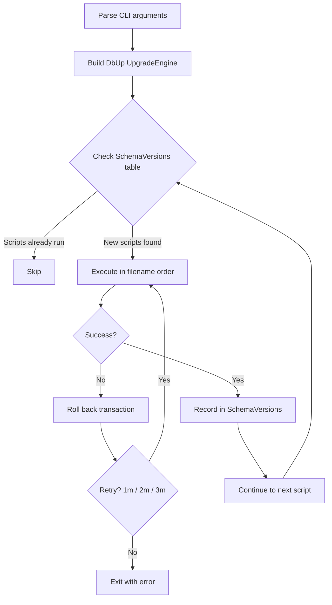

# Dfe.PlanTech.DatabaseUpgrader

A standalone console application that applies SQL Server schema migrations using [DbUp](https://dbup.readthedocs.io/en/latest/). Run as part of the deployment pipeline before the main application starts.

## Target framework

.NET 8.0

## Dependencies

| Package | Purpose |
|---|---|
| `dbup` | Migration engine — tracks and executes SQL scripts |
| `CommandLineParser` | CLI argument parsing |
| `Polly` | Retry policy on migration failure |
| `Azure.Identity` | Azure authentication support |

## How it works



All scripts run inside a **single transaction** — if any script fails, the entire run rolls back and the database is left unchanged. DbUp records each successfully executed script in the `SchemaVersions` table; scripts that have already been recorded are never re-run.

## Running

```bash
dotnet run -- -c "Server=[server];Database=[database];User ID=[username];Password=[password]"
```

Or against a built executable:

```bash
./Dfe.PlanTech.DatabaseUpgrader -c "Server=...;Database=...;" --env dev -p key=value
```

### CLI arguments

| Argument | Short | Required | Description | Example |
|---|---|---|---|---|
| `--connectionstring` | `-c` | Yes | SQL Server connection string | `-c "Server=...;Database=..."` |
| `--env` | — | No | One or more environments whose scripts should also run | `--env dev` or `--env dev staging` |
| `--sql-params` | `-p` | No | SQL variable substitutions, space-separated as `KEY=VALUE` | `-p schemaName=dbo region=uksouth` |

## SQL scripts

Scripts live in `Scripts/`, organised by year:

```
Scripts/
├── 2023/   (21 scripts — initial schema, stored procedures, sign-in, maturity)
├── 2024/   (39 scripts — recommendations, triggers, Contentful decoupling, data fixes)
├── 2025/   (17 scripts — establishment groups, user settings, question ordering)
└── 2026/   (12 scripts — schema simplification, FK updates, column adjustments)
```

### Naming convention

```
YYYYMMdd_HHmmss_DescriptiveName.sql
```

Example: `20240315_143022_AddRecommendationStatusIndex.sql`

Scripts execute in **ascending alphabetical order** — the timestamp prefix is what controls sequencing. Always use a timestamp that reflects the intended order of execution.

> **Do not add SQL scripts via Visual Studio's "Add Existing Item" dialog.** The `.csproj` picks up all `*.sql` files under `Scripts/` and `EnvironmentSpecificScripts/` automatically via an `EmbeddedResource` glob. Just drop the file in the right folder.

### Environment-specific scripts

Scripts that should only run in certain environments go in `EnvironmentSpecificScripts/`:

```
EnvironmentSpecificScripts/
└── dev/
    └── 2023/
        └── 20230810_110900_DeleteDataForEstablishmentSproc.sql
```

Pass `--env dev` (or any environment name) at runtime to include that folder's scripts in the run. Multiple environments can be specified: `--env dev integration`.

### SQL parameters

Scripts can contain DbUp variable placeholders in the form `$(VariableName)`. Pass values at runtime with `-p`:

```bash
-p schemaOwner=dbo targetRegion=uksouth
```

> **Note:** Values are parsed by splitting on the first `=`. A value that itself contains `=` (e.g. a base64 string or connection string fragment) must not be passed this way.

## Deployment

Typical pipeline usage:

1. Build and publish the upgrader as part of the release artifact
2. Before starting the main application, run the upgrader against the target database:
   ```bash
   ./Dfe.PlanTech.DatabaseUpgrader -c "$CONNECTION_STRING" --env "$ENVIRONMENT"
   ```
3. Start the main application

The upgrader is safe to run on every deployment — scripts already recorded in `SchemaVersions` are skipped automatically.

## Transaction limitations

DbUp's single-transaction mode does not support certain T-SQL statements that cannot run inside a transaction, such as `CREATE DATABASE`, `ALTER DATABASE`, or some `CREATE FULLTEXT` operations. If a script requires such statements it must handle its own transaction boundaries. See the [Microsoft documentation on transaction limitations](https://learn.microsoft.com/en-us/sql/t-sql/language-elements/transactions-sql-data-warehouse?view=aps-pdw-2016-au7#limitations-and-restrictions) for details.

## See also

- [SQL data layer](../Dfe.PlanTech.Data.Sql/README.md) — the schema and entities this tool manages
- [Seed test data](../../tests/Dfe.PlanTech.Web.SeedTestData/README.md) — uses DatabaseUpgrader to initialise a local database
- [GitHub Actions workflows](../../.github/README.md) — `validate-scripts.yml` and deployment pipeline run this tool
