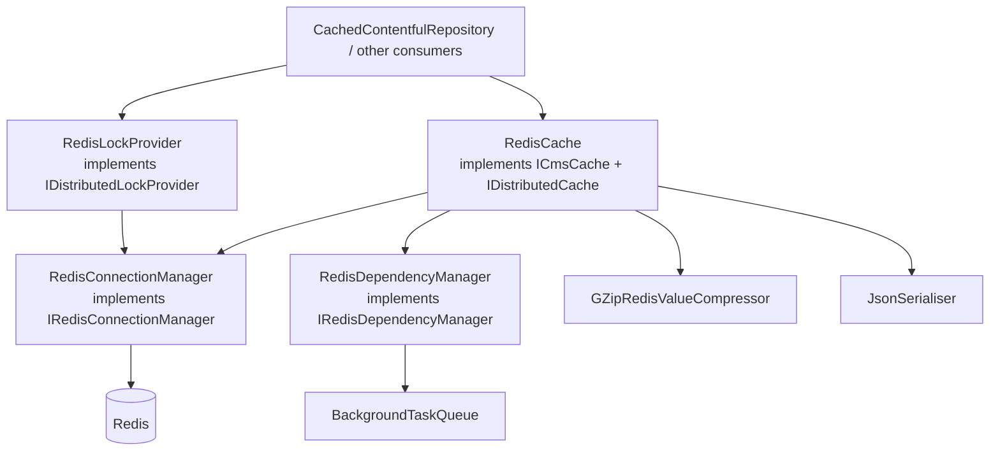

# Dfe.PlanTech.Infrastructure.Redis

Redis-backed distributed caching infrastructure for Plan Technology for Your School. Provides cache storage with automatic GZip compression, polymorphic JSON serialisation, dependency-tracked cache invalidation, and distributed locking.

## Target framework

.NET 9.0

## Dependencies

| Package | Purpose |
|---|---|
| `StackExchange.Redis` | Redis client |
| `Polly` | Retry policy for transient Redis failures |
| `Dfe.PlanTech.Application` | `IBackgroundTaskQueue` for fire-and-forget dependency registration |

## Architecture



## Components

### `RedisConnectionManager`

Manages the `ConnectionMultiplexer` instance and exposes `IDatabase` handles. Initialises the connection lazily on first use. Also provides `FlushAsync` for clearing databases (used in testing).

### `RedisCache`

The main cache implementation — fulfils both `ICmsCache` (used by `CachedContentfulRepository`) and `IDistributedCache` (defined in `Dfe.PlanTech.Core`).

**Read path:**

1. Fetch raw bytes from Redis
2. Detect and decompress GZip if present
3. Deserialise JSON with polymorphic type resolution

**Write path:**

1. Serialise to JSON (with reference cycle handling)
2. Compress with GZip if payload exceeds 200 bytes
3. Store in Redis with optional TTL
4. Queue dependency registration as a background task

**Cache invalidation** (`InvalidateCacheAsync`): given a Contentful entry ID, looks up its dependency set in Redis and removes all keys that depended on that entry. This cascades correctly when a piece of content is referenced by multiple pages.

### `RedisDependencyManager`

Tracks which cache keys depend on which Contentful entries, enabling targeted invalidation when content changes. After a cache write, it enqueues a background task that:

1. Reflects over the cached object's properties to find all nested `ContentfulEntry` references
2. For each referenced entry ID, adds the parent cache key to a Redis set keyed as `Dependency:{entryId}`
3. Entries with no content dependencies are added to a catch-all `Missing` set so they are invalidated when any new content arrives

Dependency registration runs via `IBackgroundTaskQueue` so it never blocks the request path.

### `GZipRedisValueCompressor`

Stateless utility that compresses and decompresses Redis values using GZip:

- Values smaller than **200 bytes** are not compressed (overhead would exceed saving)
- Already-compressed values are detected by checking for the GZip magic bytes (`0x1f 0x8b`) and skipped
- Works on both `byte[]` and `RedisValue` types

### `JsonSerialiser`

Stateless utility providing `Serialise<T>()` and `Deserialise<T>()` extension methods using `System.Text.Json`. Configured with:

- Polymorphic type resolution for `ContentfulEntry` and `IContentfulEntry` hierarchies (so deserialisation reconstructs the correct concrete subtype)
- `ReferenceHandler.Preserve` to handle object graphs with shared references
- `MaxDepth = 256` to accommodate deeply nested content trees

### `RedisLockProvider`

Distributed lock implementation using Redis' native `SETNX`-style lock primitives. Supports:

| Method | Description |
|---|---|
| `WaitForLockAsync` | Spin-waits until the lock is acquired or the max wait time is exceeded |
| `LockAndRun` | Acquire lock → execute action → release lock |
| `LockAndGet<T>` | Acquire lock → execute function → release lock → return result |
| `LockExtendAsync` | Extend an already-held lock's TTL |
| `LockReleaseAsync` | Release a held lock by key + lock value |

Lock values are GUIDs. Backoff between retries uses a random delay (50–600 ms) to reduce thundering-herd contention. Lock operations target the Redis primary (`CommandFlags.DemandMaster`).

### `RedisDb`

Constants for the two logical Redis databases used by the application:

| Constant | Database ID | Purpose |
|---|---|---|
| `RedisDb.General` | `0` | General CMS content cache |
| `RedisDb.Aggregations` | `1` | Aggregated/computed data |

## Configuration

| Key | Description |
|---|---|
| `ConnectionStrings:Redis` | StackExchange.Redis connection string |

For deployed environments set this in **Azure Key Vault**. For local development use `dotnet user-secrets`:

```shell
dotnet user-secrets set ConnectionStrings:Redis "localhost:6379,abortConnect=false"
```

## Running Redis locally

```bash
docker run -p 6379:6379 --name plantech-redis -d redis
```

Then set the connection string to `localhost:6379,abortConnect=false`.

If you use a JetBrains IDE, you can connect a Redis browser using the same connection string to inspect and edit cache entries directly.

## See also

- [Contentful data layer](../Dfe.PlanTech.Data.Contentful/README.md) — `CachedContentfulRepository` uses this infrastructure
- [Redis caching strategy](../../docs/cms/contentful-redis-caching.md) — architecture and dependency invalidation model
- [ADR 0041 — Redis cache](../../docs/architecture-decision-record/0041-redis-cache.md) — decision record for adopting Redis
