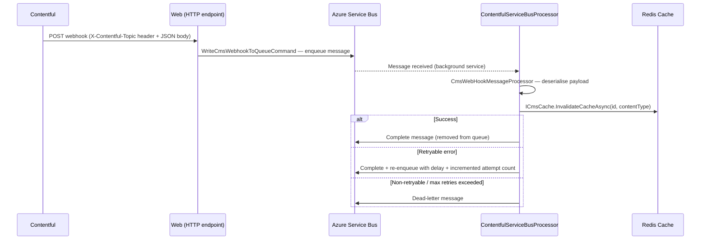

# Dfe.PlanTech.Infrastructure.ServiceBus

Handles the Azure Service Bus integration for receiving Contentful CMS webhook events and invalidating the Redis cache in response. When content is published in Contentful, a webhook fires an HTTP request to the application, which queues a message; a background service consumes that message and purges the affected cache entries.

For more information on the CMS integration see [docs/cms/README.md](/docs/cms/README.md).

## Target framework

.NET 9.0

## Dependencies

| Package | Purpose |
|---|---|
| `Azure.Messaging.ServiceBus` | Azure Service Bus client — processor, sender |
| `Microsoft.Extensions.Azure` | Azure client factory for DI registration |
| `Newtonsoft.Json` | Deserialises incoming webhook payloads |
| `Dfe.PlanTech.Application` | `ICmsCache` for cache invalidation; `IBackgroundTaskQueue` |

## Message flow



## Components

### Ingress — HTTP → Queue

**`WriteCmsWebhookToQueueCommand`**

Receives the raw webhook call from Contentful. Reads the `X-Contentful-Topic` header (e.g. `ContentManagement.Entry.publish`) as the message subject, serialises the JSON body, and hands it to `QueueWriter`.

**`QueueWriter`**

Wraps `ServiceBusSender`. Creates a `ServiceBusMessage` with the body and subject, sends it, and returns a `QueueWriteResult` indicating success or failure.

### Processing — Queue → Cache invalidation

**`ContentfulServiceBusProcessor`** (`BackgroundService`)

Registers message and error handlers on the `ServiceBusProcessor` and runs continuously for the lifetime of the application. Each message is processed in its own DI scope. If an unhandled exception escapes the handler, the message is dead-lettered immediately with the exception details.

Queue reading can be disabled entirely via `ServiceBusOptions.EnableQueueReading = false`.

**`CmsWebHookMessageProcessor`**

Deserialises the message body to `CmsWebHookPayload`, extracts the entry `Id` and `ContentType`, then calls `ICmsCache.InvalidateCacheAsync`. Returns `ServiceBusSuccessResult` on success, or a `ServiceBusErrorResult` with `IsRetryable = false` for JSON errors and `IsRetryable = true` for everything else.

**`ServiceBusResultProcessor`**

Decides what to do with the result:

| Result | Action |
|---|---|
| `ServiceBusSuccessResult` | Complete the message |
| `ServiceBusErrorResult` (retryable, below max attempts) | Complete + re-enqueue via `MessageRetryHandler` |
| `ServiceBusErrorResult` (non-retryable or max attempts reached) | Dead-letter the message |

**`MessageRetryHandler`**

Creates a new `ServiceBusMessage` with the same body and subject, increments a `DeliveryAttempts` custom property, and schedules it with a configurable delay. The original message has already been completed, so the retry goes to the back of the queue, allowing other messages to be processed in the meantime.

### Models

`CmsWebHookPayload` maps the Contentful webhook JSON body:

```
{
  sys: {
    id: "abc123",           → CmsWebHookPayload.Id
    type: "Entry",          → CmsWebHookPayload.ContentType
    contentType: { sys: { id: "page" } },
    environment: { ... },
    ...
  },
  fields: { ... }
}
```

## Configuration

| Key | Required | Description |
|---|---|---|
| `ConnectionStrings:ServiceBus` | Yes | Azure Service Bus namespace connection string |
| `ServiceBusOptions:EnableQueueReading` | No | Set to `false` to disable background processing (default: `true`) |
| `MessageRetryHandlingOptions:MaxMessageDeliveryAttempts` | No | Maximum delivery attempts before dead-lettering (default: `4`) |
| `MessageRetryHandlingOptions:MessageDeliveryDelayInSeconds` | No | Delay in seconds between retry attempts (default: `10`) |

The connection uses `DefaultAzureCredential` — in Azure this resolves to the application's managed identity. For local development, ensure you are signed in with the Azure CLI (`az login`) with an account that has Service Bus Data Owner rights on the namespace.

## Service registration

```csharp
services.AddDbWriterServices(configuration);
```

This registers the background service, all processors and handlers, and configures the Service Bus processor and sender for the `contentful` queue (prefetch count: 10).
