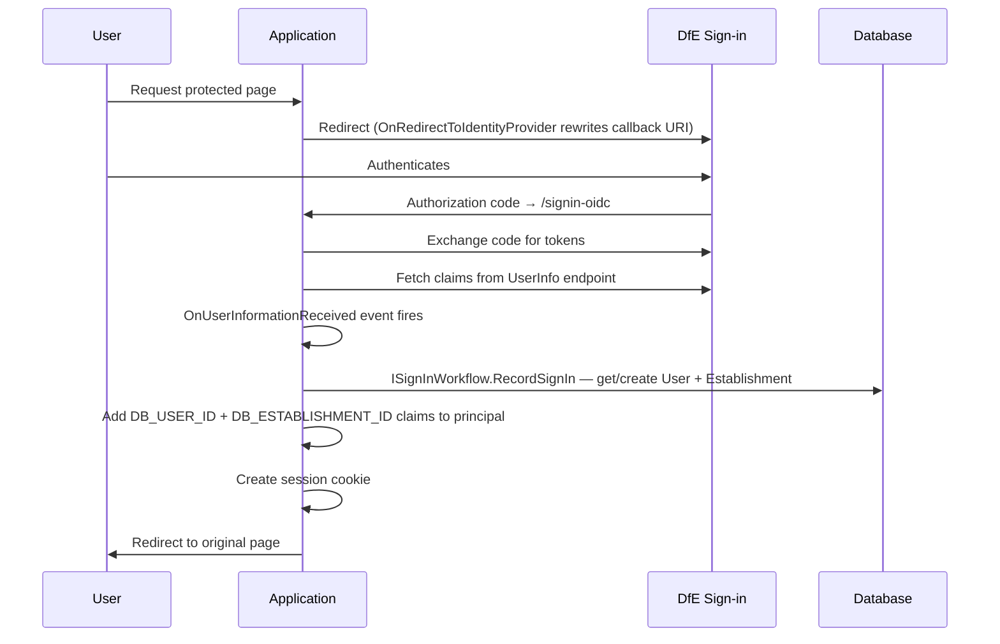

# Dfe.PlanTech.Infrastructure.SignIn

Integrates the application with [DfE Sign-in](https://github.com/DFE-Digital/login.dfe.oidc-dotnetclient) using OpenID Connect (Authorization Code flow). Handles the full sign-in lifecycle: redirecting to DfE Sign-in, processing the returned identity, mapping it to database records, and enriching the claims principal with application-specific IDs.

## Target framework

.NET 9.0

## Dependencies

| Package | Purpose |
|---|---|
| `Microsoft.AspNetCore.Authentication.OpenIdConnect` | OIDC Authorization Code flow |
| `Microsoft.AspNetCore.Identity.UI` | ASP.NET Core Identity scaffolding |
| `Dfe.PlanTech.Application` | `ISignInWorkflow`, `DfeSignInConfiguration` |

## Authentication flow



## Components

### `ServiceCollectionExtensions`

Entry point for DI setup. Call `services.AddDfeSignIn(configuration)` to register everything. Configures:

- **Cookie authentication** — session cookie with configurable name, expiry, sliding expiration, and `SameSite=Lax; Secure`
- **OpenID Connect** — Authorization Code flow with configurable scopes, callback paths, and event hooks
- **Forwarded headers** — `X-Forwarded-For` and `X-Forwarded-Proto` support for deployment behind a proxy or Azure Front Door

### `DfeOpenIdConnectEvents`

Hooks into the OIDC redirect events to rewrite callback and post-logout URIs. This is necessary because the application runs behind Azure Front Door — the internal host seen by ASP.NET Core differs from the external URL that DfE Sign-in must redirect back to.

The correct origin URL is taken from the `X-Forwarded-Host` header if present, falling back to `DfeSignIn:FrontDoorUrl` from configuration. A missing URL scheme defaults to `https://`.

### `OnUserInformationReceivedEvent`

Fires after DfE Sign-in returns the user's claims. Responsible for:

1. Extracting the DSI reference from the `nameidentifier` claim
2. Deserialising the `organisation` claim (a JSON blob) into an `EstablishmentModel`
3. Calling `ISignInWorkflow.RecordSignIn` to get-or-create the `User` and `Establishment` database records and write a `SignIn` audit entry
4. Adding `db_user_id` and `db_establishment_id` claims to the principal so downstream code can identify the user without hitting the database again

If a user authenticates but has no organisation assigned in DfE Sign-in, `RecordSignInUserOnly` is called instead and a warning is logged.

### `UserClaimsExtensions`

Extension methods on `IEnumerable<Claim>` and `ClaimsPrincipal`:

| Method | Returns |
|---|---|
| `GetDsiReference()` | The user's unique DfE Sign-in ID (from `nameidentifier`) |
| `GetOrganisation()` | `EstablishmentModel?` deserialised from the `organisation` claim JSON |
| `GetAuthorisationStatus()` | `UserAuthorisationStatus` — whether the user is authenticated and has an organisation |

### `UserAuthorisationResult` / `UserAuthorisationStatus`

Two small record types used to check access to a page:

- `UserAuthorisationStatus` — carries `IsAuthenticated` and `HasOrganisation` flags; `IsAuthorised` is `true` only when `HasOrganisation` is `true`
- `UserAuthorisationResult` — combines the page's access requirements with the user's status; `CanViewPage` returns `true` if the page doesn't require auth or the user is authorised

Results are stored on `HttpContext` under the key `UserAuthorisationResult.HttpContextKey`.

## Claims added to principal

| Claim | Source | Value |
|---|---|---|
| `nameidentifier` | DfE Sign-in | Unique user reference from DSI |
| `organisation` | DfE Sign-in | JSON blob with establishment details |
| `db_user_id` | Added by this project | `User.Id` from the application database |
| `db_establishment_id` | Added by this project | `Establishment.Id` from the application database |

## Configuration

All settings live under the `DfeSignIn` key. Set in **Azure Key Vault** for deployed environments, or `dotnet user-secrets` for local development.

| Key | Required | Description |
|---|---|---|
| `DfeSignIn:Authority` | Yes | DfE Sign-in OIDC authority URL |
| `DfeSignIn:MetaDataUrl` | Yes | OIDC discovery endpoint (`/.well-known/openid-configuration`) |
| `DfeSignIn:ClientId` | Yes | OAuth client ID for this application |
| `DfeSignIn:ClientSecret` | Yes | OAuth client secret |
| `DfeSignIn:FrontDoorUrl` | Yes | The external base URL of the application (e.g. `https://dev.plan-tech.com`) |
| `DfeSignIn:CallbackUrl` | No | OIDC callback path (default: `/signin-oidc`) |
| `DfeSignIn:SignoutCallbackUrl` | No | Post-logout callback path |
| `DfeSignIn:SignoutRedirectUrl` | No | Where to redirect after sign-out |
| `DfeSignIn:CookieName` | No | Session cookie name |
| `DfeSignIn:CookieExpireTimeSpanInMinutes` | No | Session lifetime in minutes |
| `DfeSignIn:SlidingExpiration` | No | Whether to reset expiry on activity |
| `DfeSignIn:Scopes` | No | OIDC scopes to request (e.g. `openid`, `profile`, `email`) |

## Running locally

The application must run over **HTTPS** — DfE Sign-in will reject HTTP callback URLs with a correlation error:

```
Exception: Correlation failed.
Exception: An error was encountered while handling the remote login.
```

Configure Kestrel to use HTTPS in `appsettings.Development.json`:

```json
"Kestrel": {
  "Endpoints": {
    "Https": {
      "Url": "https://localhost:16251"
    }
  }
}
```

Then set `DfeSignIn:FrontDoorUrl` to match:

```shell
dotnet user-secrets set DfeSignIn:FrontDoorUrl https://localhost:16251
```
