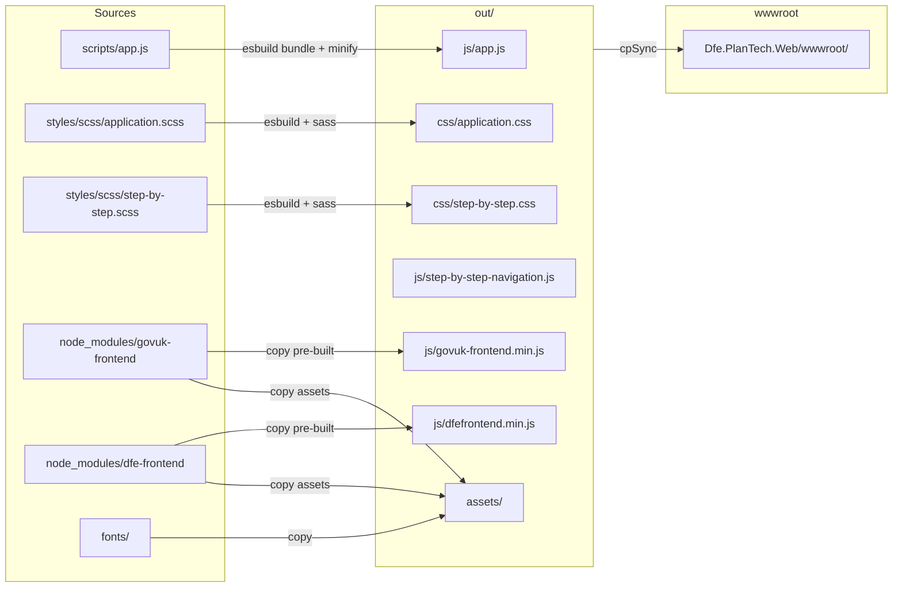

# Dfe.PlanTech.Web.Node

A Node.js build project that compiles and bundles all frontend assets for `Dfe.PlanTech.Web`. It is not a standalone application — its sole purpose is to produce the CSS, JavaScript, fonts, and images that end up in `Dfe.PlanTech.Web/wwwroot/`.

## Dependencies

| Package | Purpose |
|---|---|
| `govuk-frontend` | GOV.UK Design System CSS and JavaScript |
| `dfe-frontend` | DfE extensions to the GOV.UK Design System |
| `@govuk-prototype-kit/step-by-step` | Step-by-step navigation pattern |
| `esbuild` | JavaScript and SCSS bundling, minification |
| `esbuild-sass-plugin` | SCSS compilation via esbuild |
| `sass` | Dart Sass compiler |

## Build output

Running `npm run build` compiles everything and copies it directly into `../Dfe.PlanTech.Web/wwwroot/`:



### JavaScript outputs

| File | Source |
|---|---|
| `js/app.js` | `scripts/app.js` — bundled and minified |
| `js/govuk-frontend.min.js` | Copied from `govuk-frontend` dist |
| `js/dfefrontend.min.js` | Copied from `dfe-frontend` dist |
| `js/step-by-step-navigation.js` | Extracted from `@govuk-prototype-kit/step-by-step` |
| `js/step-by-step-polyfills.js` | Extracted from `@govuk-prototype-kit/step-by-step` |

### CSS outputs

| File | Source |
|---|---|
| `css/application.css` | `styles/scss/application.scss` — full site stylesheet |
| `css/step-by-step.css` | `styles/scss/step-by-step.scss` — step-by-step navigation pattern |

### Assets

GOV.UK Frontend images and fonts, DfE Frontend images, GOV.UK rebrand assets, and the custom Inter font family (weights 100–900, normal and italic, including variable fonts) are all copied to `assets/`.

## Source files

### `scripts/app.js`

Entry point. Currently instantiates `BrowserHistory`, a custom class that tracks visited URLs in `localStorage` and keeps the back button links (`#back-button-link`, `#notification-go-back-link`) pointing at the correct previous page. History is cleared on navigation to `/` or `/home`.

### `styles/scss/application.scss`

Main stylesheet entry point. Imports in order:

1. Inter font declarations (`inter.scss`)
2. `govuk-frontend` — full GOV.UK Design System
3. `dfe-frontend` — DfE extensions
4. Application-specific partials: variables, task list, card component, hero banner, header overrides, navigation, print styles, etc.

### `styles/scss/step-by-step.scss`

Separate entry point for the step-by-step navigation pattern. Imports the GOV.UK base styles and the three step-by-step SCSS partials from `@govuk-prototype-kit/step-by-step`.

## Running the build

```bash
cd src/Dfe.PlanTech.Web.Node
npm install
npm run build
```

To run as part of the .NET build:

```bash
cd src/Dfe.PlanTech.Web
dotnet build /p:buildWebAssets=true
```

The `buildWebAssets` MSBuild property triggers a `BeforeTargets="Build"` target in `Dfe.PlanTech.Web.csproj` that runs `npm install` and `npm run build` automatically. Without this flag, the .NET build uses whatever is already in `wwwroot/`.

## Linting

```bash
npm run lint
```

Uses the shared ESLint config at the repository root (`eslint.config.mjs`).

## Adding new assets

- **JavaScript:** Add files to `scripts/`, import or initialise them in `scripts/app.js`
- **SCSS:** Add partials to `styles/scss/`, import them in `styles/scss/application.scss`
- **Fonts:** Add WOFF2 files to `fonts/`, declare them in `styles/scss/inter.scss` (or a new font partial)

After any change, re-run `npm run build` to update `wwwroot/`.

## See also

- [Web application](../Dfe.PlanTech.Web/README.md) — consumes the assets built by this project
- [Coding style and formatting](../../coding-style/README.md) — JS/CSS formatting rules enforced via pre-commit hooks
