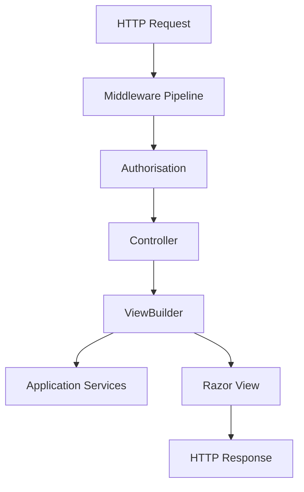
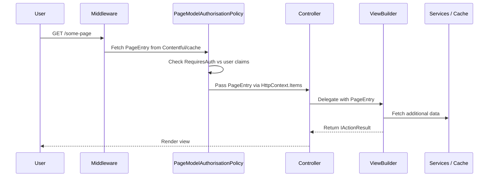

# Dfe.PlanTech.Web

The ASP.NET Core MVC presentation layer for Plan Technology for Your School. Handles all HTTP routing, authentication, authorisation, page rendering, and the questionnaire/recommendation user journey.

## Target framework

.NET 9.0

## Dependencies

### NuGet packages

| Package | Purpose |
|---|---|
| `GovUk.Frontend.AspNetCore` | GOV.UK Design System Razor tag helpers |
| `Azure.Extensions.AspNetCore.Configuration.Secrets` | Azure Key Vault configuration provider |
| `Azure.Extensions.AspNetCore.DataProtection.Keys` | Azure Key Vault for Data Protection key storage |
| `Microsoft.ApplicationInsights.AspNetCore` | Application Insights telemetry |
| `Microsoft.Extensions.Http.Polly` | HTTP client retry policies |
| `System.Linq.Async` | Async LINQ operators |

### Project references

| Project | Role |
|---|---|
| `Dfe.PlanTech.Application` | Services and workflows — business logic |
| `Dfe.PlanTech.Core` | Shared models, interfaces, constants |
| `Dfe.PlanTech.Data.Contentful` | CMS content retrieval |
| `Dfe.PlanTech.Infrastructure.SignIn` | DfE Sign-in / OIDC authentication |
| `Dfe.PlanTech.Infrastructure.ServiceBus` | Azure Service Bus for CMS webhook processing |
| `Dfe.PlanTech.Infrastructure.Redis` | Redis distributed cache |

## Architecture



Controllers are deliberately thin — they validate model state and delegate all logic to a corresponding **ViewBuilder**, which assembles the ViewModel and returns the `IActionResult`.

## Controllers

| Controller | Routes | Responsibility |
|---|---|---|
| `PagesController` | `GET /{route}` | Resolves CMS pages by slug; routes MAT users to school selection |
| `QuestionsController` | `/questions/*` | Full self-assessment flow — display questions, submit answers, continue/restart |
| `RecommendationsController` | `/recommendations/*` | Display, print, and update recommendation status |
| `ReviewAnswersController` | `/check-answers`, `/view-answers` | Answer review and submission confirmation |
| `GroupsController` | `/groups/*` | School selection for MAT/group users |
| `CookiesController` | `/cookies` | Cookie preferences and banner management |
| `CmsController` | `/cms/*` | API endpoints — CMS webhook ingestion and section/chunk data |
| `AuthController` | `/auth/sign-out` | Sign-out |
| `BaseController` | — | Abstract base providing typed logger injection |

## ViewBuilders

Each controller has a corresponding ViewBuilder (`IXxxViewBuilder` / `XxxViewBuilder`). ViewBuilders are responsible for fetching data from application services, constructing ViewModels, and returning the final `IActionResult`.

| ViewBuilder | Primary responsibility |
|---|---|
| `QuestionsViewBuilder` | Routes through the questionnaire — next question, answer submission, continue/restart, interstitial pages |
| `RecommendationsViewBuilder` | Builds recommendation views with status history; handles single and print-all layouts |
| `ReviewAnswersViewBuilder` | Check-answers and view-answers flows; confirms submission |
| `PagesViewBuilder` | Routes CMS pages based on organisation type (school vs MAT) |
| `GroupsViewBuilder` | MAT school selection and group establishment linking |
| `CategoryLandingViewComponentViewBuilder` | Category landing page with section progress and recommendation summaries |
| `CategorySectionViewComponentViewBuilder` | Section card grid for a category |
| `CmsViewBuilder` | Section list and recommendation chunk pagination for CMS API endpoints |
| `FooterLinksViewComponentViewBuilder` | Navigation links for the footer |

## Middleware pipeline

Registered in order:

| Middleware | Purpose |
|---|---|
| `ExploitPathMiddleware` | Blocks requests to `/admin` paths and `.php` extensions — returns 404 |
| `HeadRequestMiddleware` | Converts HEAD requests to GET and strips the response body |
| `RobotsTxtMiddleware` | Serves `robots.txt` dynamically from configuration |
| `SecurityHeadersMiddleware` | Adds `X-Frame-Options` (SAMEORIGIN) and a nonce-based `Content-Security-Policy` |
| `ServiceExceptionHandlerMiddleWare` | Routes specific exceptions to appropriate error pages (Contentful unavailable → service error; invalid establishment → access denied; etc.) |

## Authorisation

Three authorisation policies are in use:

### `PageAuthorisationRequirement`
Handled by `PageModelAuthorisationPolicy`. For every page request, fetches the `PageEntry` from Contentful (via cache) and checks whether the page requires the user to be authenticated and have an organisation. Stores the resolved `PageEntry` in `HttpContext.Items` for use by the `PageModelBinder`.

### `UserOrganisationAuthorisationRequirement`
Handled by `UserOrganisationAuthorisationHandler`. Verifies the user's claims include an organisation. Sign-out URLs are exempt. Unauthenticated or unauthorised users are redirected via `UserAuthorisationMiddlewareResultHandler`.

### `SignedRequestAuthorisationRequirement`
Handled by `SignedRequestAuthorisationPolicy`. Validates incoming CMS webhook requests using HMAC-SHA256 signature verification (timestamp + body + signed-headers, Contentful-style). Used on `CmsController` webhook endpoints.

API key endpoints additionally use `ApiKeyAuthorisationFilter`, which checks a Bearer token against `ApiAuthenticationConfiguration`.

## Request flow — authenticated page



## Key supporting components

### `CurrentUser`

Scoped service implementing `ICurrentUser`. Provides the current user's identity context to the rest of the application:

- **User organisation** — URN, UKPRN, UID, DfE Sign-in ID, type, name (from claims)
- **Active establishment** — for MAT users, this is the selected school; for others, it is their own organisation
- **Group school selection** — stored in a cookie; `LoadSelectedSchoolAsync` validates the selection is a member of the user's group

### `ComponentViewsFactory`

Maps Contentful component model types to their corresponding shared Razor view paths at runtime, by scanning compiled view types in the assembly. Used by `PageComponentFactory.cshtml` to render CMS-driven page content polymorphically.

### `PageModelBinder`

A custom `IModelBinder` for `PageEntry`. Reads the page object placed in `HttpContext.Items` by `PageModelAuthorisationPolicy` so controllers can receive it as a normal action parameter without a second Contentful lookup.

### Tag helpers

| Tag helper | Renders |
|---|---|
| `RichTextTagHelper` | Contentful rich text fields to HTML |
| `GridContainerTagHelper` | Card grid containers |
| `HeadingComponentTagHelper` | Dynamic `<h1>`–`<h6>` from CMS header entries |
| `WarningComponentTagHelper` | GOV.UK warning text component |
| `FooterLinkTagHelper` | Individual footer navigation links |
| `TaskListTagHelper` / `TaskListItemTagHelper` / etc. | GOV.UK task list pattern components |

## Configuration

All secrets should be stored in **Azure Key Vault** for deployed environments and `dotnet user-secrets` locally. See the individual infrastructure READMEs for required keys:

- [DfE Sign-in](../Dfe.PlanTech.Infrastructure.SignIn/README.md)
- [Contentful](../Dfe.PlanTech.Data.Contentful/README.md)
- [Redis](../Dfe.PlanTech.Infrastructure.Redis/README.md)
- [SQL / Database](../Dfe.PlanTech.Data.Sql/README.md)

The full set of secrets for each environment is available in the Azure Key Vault — contact the team for access.

## Frontend assets

Static assets (CSS, JS, fonts, images) are built by [`Dfe.PlanTech.Web.Node`](../Dfe.PlanTech.Web.Node/README.md) and output to `wwwroot/`. To rebuild them:

```bash
cd ../Dfe.PlanTech.Web.Node
npm install && npm run build
```

Or trigger the build as part of the .NET build:

```bash
dotnet build /p:buildWebAssets=true
```

## Running locally

1. Configure secrets (see links above)
2. Run with HTTPS enabled (required for DfE Sign-in):
   ```bash
   dotnet run --launch-profile https
   ```
3. If using a local Redis instance or local database, see the relevant infrastructure READMEs linked above.
