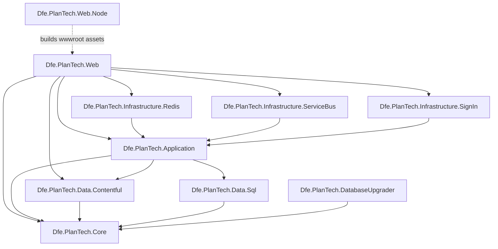

# Source projects

This folder contains all application source projects for Plan Technology for Your School — a DfE service that helps schools self-assess their technology maturity and receive targeted recommendations.

## Projects

| Project | Type | Purpose |
|---|---|---|
| [Dfe.PlanTech.Core](Dfe.PlanTech.Core/) | Class library | Shared models, interfaces, enumerations, constants, helpers, and DTOs used across all other projects |
| [Dfe.PlanTech.Application](Dfe.PlanTech.Application/) | Class library | Application layer — services, workflows, and rich text rendering |
| [Dfe.PlanTech.Data.Sql](Dfe.PlanTech.Data.Sql/) | Class library | SQL Server data access — EF Core entities, repositories, and stored procedure execution |
| [Dfe.PlanTech.Data.Contentful](Dfe.PlanTech.Data.Contentful/) | Class library | Contentful CMS data access — repository with caching decorator and polymorphic deserialisation |
| [Dfe.PlanTech.Infrastructure.Redis](Dfe.PlanTech.Infrastructure.Redis/) | Class library | Redis-backed distributed cache with GZip compression, dependency tracking, and distributed locking |
| [Dfe.PlanTech.Infrastructure.ServiceBus](Dfe.PlanTech.Infrastructure.ServiceBus/) | Class library | Azure Service Bus integration — receives Contentful webhooks and triggers cache invalidation |
| [Dfe.PlanTech.Infrastructure.SignIn](Dfe.PlanTech.Infrastructure.SignIn/) | Class library | DfE Sign-in integration via OpenID Connect — authentication, claims enrichment, and session management |
| [Dfe.PlanTech.Web](Dfe.PlanTech.Web/) | ASP.NET Core MVC web app | Presentation layer — controllers, views, authorisation, and middleware |
| [Dfe.PlanTech.Web.Node](Dfe.PlanTech.Web.Node/) | Node.js build project | Compiles and bundles frontend assets (CSS, JS, fonts) into `Dfe.PlanTech.Web/wwwroot/` |
| [Dfe.PlanTech.DatabaseUpgrader](Dfe.PlanTech.DatabaseUpgrader/) | Console application | SQL Server schema migration tool using DbUp — run as part of deployment before the web app starts |

## Dependency graph



## Layered architecture

The solution is structured in layers, with dependencies flowing inward:

```
┌─────────────────────────────────────────┐
│           Dfe.PlanTech.Web              │  Presentation — HTTP, views, auth
├─────────────────────────────────────────┤
│        Dfe.PlanTech.Application         │  Business logic — services, workflows, rendering
├────────────────────┬────────────────────┤
│  Dfe.PlanTech.     │  Dfe.PlanTech.     │  Data access
│  Data.Sql          │  Data.Contentful   │
├────────────────────┴────────────────────┤
│           Dfe.PlanTech.Core             │  Shared kernel — no infrastructure dependencies
└─────────────────────────────────────────┘

Infrastructure projects (Redis, ServiceBus, SignIn) are plug-in adapters
wired up at the Web layer and depend on Application interfaces.
```

## Runtime data flows

### User request — serving a page

1. **Web** receives HTTP request; middleware pipeline runs security checks
2. `PageModelAuthorisationPolicy` fetches the `PageEntry` from **Data.Contentful** (via Redis cache)
3. Controller delegates to a **ViewBuilder** in the Application layer
4. ViewBuilder calls **Application** services, which call **Data.Sql** and/or **Data.Contentful** repositories
5. Data.Contentful reads from the Redis cache (**Infrastructure.Redis**); on a miss, fetches from Contentful API
6. ViewModel is assembled and rendered by a Razor view

### CMS content publish — cache invalidation

1. Contentful fires a webhook HTTP POST to **Web** (`CmsController`)
2. `WriteCmsWebhookToQueueCommand` enqueues the payload to **Azure Service Bus**
3. `ContentfulServiceBusProcessor` (background service in **Infrastructure.ServiceBus**) dequeues the message
4. `CmsWebHookMessageProcessor` calls `ICmsCache.InvalidateCacheAsync` on **Infrastructure.Redis**
5. Affected Redis cache keys are purged; next request re-fetches from Contentful

### Database migration — deployment

1. **DatabaseUpgrader** is run before the web application starts
2. DbUp compares embedded SQL scripts against the `SchemaVersions` table
3. New scripts are executed in filename order within a single transaction
4. Web application starts against the up-to-date schema
