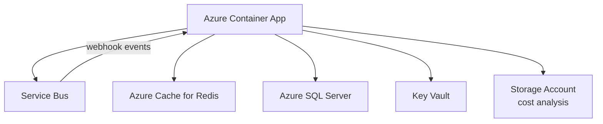

# Terraform

Infrastructure as Code for the Plan Technology for Your School service, using [Terraform](https://www.terraform.io/) to manage Azure resources.

## Modules

| Directory | Purpose |
|---|---|
| [`container-app/`](container-app/README.md) | Full application infrastructure — Container Apps, SQL Server, Redis, Key Vault, Service Bus, Contentful webhook |
| [`dns-zone/`](dns-zone/README.md) | Azure DNS zones for each environment, including subdomain delegation for staging |

## Azure resources managed

The `container-app` module provisions the following for each environment:

- **Azure Container Apps** — hosts the .NET web application
- **Azure SQL Server** — application database
- **Azure Cache for Redis** — distributed content cache
- **Azure Key Vault** — secrets and app configuration
- **Azure Service Bus** — Contentful webhook event queue
- **Storage Account** — cost analysis data
- **Contentful webhook** — provisioned via the `webhook-creator` tool, invoked as a Terraform null resource

## CI/CD

Terraform runs are handled by GitHub Actions:

- `terraform-pr-check.yml` — runs `init`, `plan`, `fmt`, `lint`, and security check on every PR; posts the plan output as a PR comment
- `infrastructure-deploy.yml` / `terraform-dns.yml` — applies changes to a named environment on merge or manual trigger

See [`.github/README.md`](../.github/README.md) for workflow details.

## Local development

See [`container-app/README.md`](container-app/README.md) for full local setup instructions including authentication, `terraform init`, `plan`, and `apply` commands.

> Do not commit `.tfvars` files — they are git-ignored and contain environment-specific secrets.
